# گزارش دموی پنل مدیریت (`/lab/admin/`)

> این گزارش دور اول است: دموی پنل با پروفایل VPN. گزارش دور دوم (Spindle Admin Kit، پروفایل سرور و ممیزی نمایش) در [REPORT.md](REPORT.md) است.

پنل مدیریت GozarX حالا به‌شکل یک کیت قابل‌برندسازی (white-label) با دادهٔ ساختگی، داخل پورتفولیو در مسیر `/lab/admin/` منتشر می‌شود. یک کد برای پنج کسب‌وکار کار می‌کند: سرویس VPN، فضای کار تیمی (SaaS)، فروشگاه آنلاین لوازم خانه، آکادمی آنلاین و چاپخانهٔ چاپ‌وارسال. همه‌چیز از فایل‌های استاتیک و داخل مرورگر اجرا می‌شود: نه API هست، نه ورود، نه هیچ درخواستی به میزبان دیگر.

- شاخه: `feat/admin-demo`، با PR به `baseline`: [BoofKoor/sedmehdi#1](https://github.com/BoofKoor/sedmehdi/pull/1)
- اجرای محلی: `npm install`، بعد `npm run build` و سرو کردن `dist/` (مثلاً `python3 -m http.server 4321 --directory dist`)، و باز کردن `http://localhost:4321/lab/admin/?profile=vpn`.
- بررسی‌ها: `npm run test:demo` (تست‌های واحد) و `python3 scripts/qa/check_admin_demo.py http://localhost:4321 --prove` (بررسی‌های مرورگر، هر کدام اول روی صفحهٔ خراب و بعد روی صفحهٔ درست).

---

## ۱. برنامهٔ تأییدشده و انحراف‌ها

### برنامهٔ تأییدشده (خلاصه)

- **جای کد:** یک workspace جدا در `apps/admin-demo` (React 18، Vite 8، Tailwind 3، TypeScript). `npm run build` اول `astro build` و بعد دمو را در `dist/lab/admin/` می‌سازد، با مسیرهای نسبی (`base: "./"`). خروجی خود پورتفولیو بایت‌به‌بایت همان می‌ماند (جز پوشهٔ `lab/` و تغییرهای ادغام در بخش ۱۱).
- **مسیریابی hash** (`#/`، `#/growth`، `#/retention`، `#/behaviour`، دو جدول هر کسب‌وکار مثل `#/users` و `#/servers`، و `#/health`)، چون پشت فایل‌های استاتیک هیچ rewrite سروری نیست.
- **یک `BusinessProfile` برای هر کسب‌وکار** که برند، منو، KPIها، سری‌های نمودار، محورهای رادار، آمار زنده، بررسی‌های سلامت، ستون‌های جدول و همهٔ متن‌ها را به انگلیسی و فارسی تعیین می‌کند.
- **generator قطعی (seeded)** برای هر پروفایل و بازه، با روند و ریتم هفتگی، «امروز، هنوز در جریان» به‌صورت خط‌چین، و مقایسه با بازهٔ قبلی هم‌طول.
- **نمودارهای دست‌ساز SVG** از خود پنل GozarX (sparkline قهرمان، رادار، روند)، به‌همراه کیت UI، پوستهٔ کنسول و پالت Nocturne که برای هر برند دوباره رنگ‌دهی می‌شود.
- **QA:** اسکریپت Playwright با حالت `--prove` که خطا را از بیرون تزریق می‌کند (init script، CSS، بازنویسی پاسخ)؛ هیچ «کلید خرابی» داخل کد منتشرشده نیست.

### تصمیم‌های پیام دوم و اجرای آن‌ها

| تصمیم | چه شد |
|---|---|
| همهٔ پیام‌ها و REPORT.md به فارسی؛ کد، کامیت و کامنت انگلیسی | انجام شد. |
| سایت zip بدون تغییر در `baseline`؛ PR از `feat/admin-demo` به `baseline`؛ بدون `main` | `baseline` با یک کامیت (`3fea190 Import the site as delivered (v0.13.2)`) push شد؛ `main` ساخته یا push نشد. |
| `preview/` در `.gitignore` و کامیت‌نشدن فایل پیش‌نمایش | `preview` از قبل در `.gitignore` خود zip بود (خط `preview`)، پس تغییری لازم نشد و فایل پیش‌نمایش هیچ‌وقت کامیت نشد. |
| نام شاخه `feat/admin-demo` | push به همین شاخه کار کرد؛ شاخهٔ پیش‌فرض این session (`claude/gozarx-admin-demo-0mlwl4`) استفاده نشد. |
| تم: کلید مشترک `sm-theme` | دمو در اولین بار تم ذخیره‌شدهٔ پورتفولیو را می‌خواند، تغییرش را در همان کلید می‌نویسد، و تغییر تم در تب دیگرِ پورتفولیو را هم زنده دنبال می‌کند (رویداد `storage`). `?theme=` بدون ذخیره اعمال می‌شود. |
| نام برندها: چک در همان صنعت | سه نام اول عوض شد؛ جزئیات و منابع در بخش ۱۴. هر پنج برند در یک فایل‌اند: `apps/admin-demo/src/profiles/brands.ts`. |
| دکمهٔ Live demo روی کارت Work با چهار شرط پذیرش | همهٔ شرط‌ها در هر پنج عرض و هر دو تم برقرار است (جدول بخش ۱۱)؛ راه جایگزین لازم نشد. `stack_check` بدون تغییر رد می‌شود. |
| CSV جدول‌ها = همهٔ ردیف‌های فیلترشده و مرتب‌شده | انجام شد و بررسی `csv` آن را اندازه می‌گیرد (۱۳۵ ردیف از چند صفحه، به همان ترتیب صفحه). |
| پیش‌فرض‌ها: `?profile=vpn`، zip پیوست نه کامیت، بدون نسخهٔ single-file از دمو | انجام شد؛ `scripts/single-file.mjs` پوشهٔ `lab/` را عمداً کنار می‌گذارد و پیوندهای `/lab/` را به نشانی کامل سایت تبدیل می‌کند. |
| ناسازگاری AGPL-3.0 و نبود LICENSE | در هیچ ریپویی تغییری داده نشد؛ در بخش ۱۳ آمده است. |
| جدول قبل/بعد چهار اسکریپت QA و اندازهٔ gzip هر chunk اولین رندر | بخش‌های ۱۰ و ۷. |

### انحراف‌ها از برنامه، و دلیل هر کدام

1. **Recharts کامل کنار گذاشته شد.** پنل GozarX برای نمودارهای معمولی‌اش از recharts استفاده می‌کرد. در دمو همهٔ نمودارها دست‌ساز SVG شدند (chunk نمودار پنل اصلی، طبق CLAUDE.md خود GozarX، ۴۳۴ کیلوبایت خام بود؛ کل JS دمو با همهٔ صفحه‌ها ۱۱۵٫۰ کیلوبایت gzip است، بخش ۷)، و یک موتور نمودار زمانی مشترک (`TrendPanels`) crosshair، tooltip، صفحه‌کلید و آینه‌شدن RTL را یک‌جا دارد.
2. **بدون محور دوگانه.** نمودار اصلی GozarX دو محور y داشت. اینجا دو پنل هم‌تراز با یک crosshair و یک tooltip مشترک است: هر سنجه روی مقیاس خودش خواناست و خواننده تقاطع دو خط با مقیاس‌های بی‌ربط را معنادار نمی‌خواند.
3. **دونات حذف شد**؛ سهم‌ها با میله‌های رتبه‌دار (BarList) نشان داده می‌شوند که روی یک خط پایه مقایسه‌پذیرند.
4. **«جدید و بازگشتی» از ستون‌های پشته‌ای به دو پنل ستونی تبدیل شد.** کاربران جدید فقط چند درصد کل روزند (در SaaS حدود ۱٪) و روی پشته به یک نوار نازکِ نخواندنی تبدیل می‌شدند.
5. **کنترل بازه در یک ردیف بالای هر چیزی است که تحت تأثیرش است** (کنار زبانه‌های داشبورد)، و نمودار تجمعی رشد چون «خط» است (نه ناحیه)، محدودهٔ خودش را قاب می‌گیرد و از صفر شروع نمی‌شود؛ ناحیه‌ها و ستون‌ها همیشه از صفر.
6. **نمودارها در فارسی آینه می‌شوند** (قدیمی‌ترین روز سمت راست، برچسب‌های محور y سمت راست)، طبق خواستهٔ «mirrored layout, charts». GozarX محور زمان را در RTL هم چپ‌به‌راست نگه می‌داشت.
7. **عنوان صفحه از نوار بالا به خود صفحه آمد**، چون نوار بالا حالا جای انتخاب‌گر کسب‌وکار است که باید دیده شود.
8. **پنل کناری (نرخ‌ها، آمار زنده، سلامت) روی هر چهار زبانهٔ داشبورد می‌ماند**، نه فقط «نمای کلی» مثل GozarX، چون آمدن و رفتنش عرض کنسول را عوض می‌کرد و بررسی layout shift آن را ۰٫۱۷ اندازه گرفت.
9. **کتابخانهٔ toast (sonner) حذف شد** و یک toaster کوچک ساخته شد که ناحیهٔ `role="status"` را از قبل mount می‌کند (اعلانی که همراه ناحیه‌اش درج شود خوانده نمی‌شود) و جای نوار پایین موبایل را می‌داند.
10. **رنگ جوهر وضعیت‌ها کمی تیره‌تر (روشن) و روشن‌تر (تیره) شد**، چون بررسی کنتراست نشان «برطرف شد» را روی صفحهٔ برجستهٔ کارت ۴٫۴۷:۱ اندازه گرفت. تست پالت حالا این زوج را هم می‌سنجد.
11. **یک ردیف سلامت VPN عوض شد:** «Conversion, {days} days» یک سنجهٔ کسب‌وکار بود نه سرویس؛ جایش «Subscription links» آمد تا صفحهٔ سلامت فقط سرویس‌ها را داشته باشد.
12. **حالت دادهٔ دمو (زنده/خالی/خطا/کند) ذخیره نمی‌شود**؛ با بارگذاری دوباره به «زنده» برمی‌گردد تا کسی در حالت خطا گیر نکند. بازهٔ زمانی با کلید جدید `sm-admin-range` ذخیره می‌شود.
13. **فونت فارسی روی صفحهٔ انگلیسی هم یک فایل بار می‌کند** (`Vazirmatn-Medium.woff2`، حدود ۵۰ کیلوبایت)، چون برچسب «فا» در کلید زبان به خط خودش نوشته می‌شود.
14. **برچسب محورهای رادار HTML است، نه متن SVG.** در GozarX برچسب‌ها کوتاه و ثابت بودند. اینجا هر کسب‌وکار نام نرخ‌هایش را خودش می‌دهد، و متن SVG نه می‌شکند نه جایش را می‌داند (بخش ۸).

---

## ۲. ساختار فایل‌ها

### اپ دمو: `apps/admin-demo/` (همه جدید)

```
apps/admin-demo/
├── public/fonts/            DM Sans (Latin) + Vazirmatn (3 weights), self-hosted, with their OFL licences
├── scripts/
│   ├── palette.mjs          OKLCH palette per brand, light + dark (pure functions)
│   ├── gen-palettes.mjs     writes src/theme/palettes.css
│   └── shots.py             the screenshots in docs/admin-demo/screens/
├── src/
│   ├── profiles/            types.ts (the BusinessProfile schema), brands.ts (all five brands),
│   │                        vpn.ts, saas.ts, ecommerce.ts, education.ts, print.ts, index.ts
│   ├── data/                prng.ts, calendar.ts, model.ts (the generator), gen.ts, names.ts,
│   │                        dashboard.ts, entities.ts, health.ts, csv.ts, exports.ts, generator.test.ts
│   ├── state/               AppState.tsx (business, language, theme, range, data mode, URL + storage),
│   │                        Live.tsx (the live ticker), edits.ts (tab-only record edits), storage.ts
│   ├── components/
│   │   ├── charts/          geometry.ts (+ test), TrendPanels, HeroSparkline, RadarRates, Heatmap, Small, ChartCard
│   │   ├── shell/           BusinessPicker, CommandPalette, DemoMenu, Nav, Controls, HelpDialogs, BrandMark,
│   │   │                    chrome.tsx (side panel slot), nav.ts, useShortcuts.ts
│   │   └── ui/              Avatar, Badge, Button, Card, CountUp, Dialog, NavTabs, PageTitle, Popover,
│   │                        Segmented, States (skeleton/empty/error), Table, Toast, useFocusTrap
│   ├── pages/
│   │   ├── Dashboard.tsx    tabs + range + CSV + side panel
│   │   ├── dashboard/       Overview, Growth, Retention, Behaviour (lazy), SideBlocks
│   │   ├── Records.tsx      the two tables (lazy) + records/RecordDialog.tsx, records/cells.tsx
│   │   └── Health.tsx       service checks, 90-day uptime, incidents (lazy)
│   ├── i18n/                index.ts (t(), L pairs), ui.ts (the shell's own strings, en + fa)
│   ├── lib/                 format.ts (+ test), metric.ts, focusTitle.ts
│   ├── hooks/               media.ts, useDemoQuery.ts (simulated loading / error / empty)
│   ├── theme/               palettes.css (generated), palette.test.ts
│   ├── App.tsx  main.tsx  router.tsx  index.css
├── index.html               pre-paint bootstrap: theme, language, direction, font preload
├── vite.config.ts           base "./", output dist/lab/admin/, named chunks (react, vendor, data)
├── tailwind.config.js  postcss.config.js  tsconfig.json  tsconfig.test.json  package.json
└── README.md
```

### فایل‌های پورتفولیو که تغییر کردند یا اضافه شدند

| فایل | تغییر |
|---|---|
| `package.json`، `package-lock.json` | workspace `apps/admin-demo`؛ `build` حالا دمو را هم می‌سازد؛ اسکریپت‌های `dev:demo` و `test:demo`. |
| `src/content.config.ts` | فیلد اختیاری `lab` (یک مسیر که با `/` شروع می‌شود). |
| `src/content/projects/gozarx.md` | `lab: "/lab/admin/?profile=vpn"`. |
| `src/pages/projects/[id].astro` | دکمهٔ «Try the Live Demo» وقتی پروژه `lab` دارد. |
| `src/pages/projects/index.astro`، `src/components/WorkStack.astro`، `src/components/ProjectGrid.astro` | دکمهٔ «Live Demo» روی کارت Work (دسکتاپ: لایهٔ هم‌خانه با کارت؛ موبایل: زیر کارت). |
| `src/styles/global.css` | `.st-lab`، `.st-lab-btn`، `.fr-lab`، `.case-lab` و قاعدهٔ reduced motion آن‌ها. |
| `scripts/single-file.mjs` | پوشهٔ `lab/` را کنار می‌گذارد و پیوندهای `/lab/` را به نشانی کامل سایت می‌برد. |
| `scripts/qa/check_single.py` | `lab/` را از فهرست صفحه‌های مورد انتظار کنار می‌گذارد (با توضیح در کد). |
| `scripts/qa/audit.py` | `/lab/admin/` یک مسیر معتبر است؛ query در پیوندهای داخلی نادیده گرفته می‌شود (با توضیح در کد). |
| `scripts/qa/check_admin_demo.py` | **جدید**: بررسی‌های مرورگرِ دمو (بخش ۸). |
| `Dockerfile`، `.dockerignore`، `nginx.conf` | `npm ci` در Docker manifest workspace را هم می‌بیند؛ `node_modules` workspace وارد image نمی‌شود؛ کش یک‌ساله (immutable) برای فایل‌های hash‌دار `/lab/admin/assets/`. |
| `README.md` | معرفی `apps/admin-demo` و دستورها. |
| `docs/admin-demo/` | همین گزارش و اسکرین‌شات‌ها. |

---

## ۳. منشأ کد: چه کپی شد، چه بازنویسی شد، چه حذف شد

مبدأ همه‌چیز `frontend/admin/src` در ریپوی GozarX (نسخهٔ `cd3e46c`) است. ریپوی GozarX دست نخورد (`git status` تمیز است).

| در GozarX | در دمو | وضعیت | چرا |
|---|---|---|---|
| `components/charts/geometry.ts` و `geometry.test.ts` | `src/components/charts/geometry.ts` و تستش | **کپی بدون تغییر** (+ تابع `niceTicks` که از `Overview.tsx` آمد، و `niceRange` جدید) | ریاضی مسیرها همان است؛ تست‌ها هم آمدند. |
| `charts/HeroSparkline.tsx`، `charts/RadarRates.tsx`، `charts/MiniTrend.tsx` | `HeroSparkline.tsx`، `RadarRates.tsx`، `Small.tsx` | بازنویسی سبک | آینه‌شدن RTL، رنگ از متغیرهای CSS به‌جای `tokenColor` (تعویض تم بدون render)، کنتراست کامل متن‌ها. در رادار، برچسب محورها HTML شد (بخش ۸). |
| `charts/AreaTrend.tsx` | `TrendPanels.tsx` | بازنویسی | دو پنل به‌جای دو محور، هندسهٔ پیکسلی با اندازه‌گیری عرض، ستون/خط/ناحیه، صفحه‌کلید و اعلان صوتی. |
| `dashboard/overview/Overview.tsx`، `tiles.tsx`، `SidePanel.tsx` | `pages/dashboard/Overview.tsx`، `SideBlocks.tsx` | بازنویسی | همان ترکیب و اندازه‌ها، ولی همه‌چیز از پروفایل؛ count-up، skeleton و حالت‌های خالی/خطا. |
| `dashboard/RetentionCohorts.tsx`، `ActivityHeatmap.tsx` | `pages/dashboard/Retention.tsx`، `charts/Heatmap.tsx` | بازنویسی سبک | ترتیب روزهای هفته بر اساس زبان، رنگ‌های سنجیده‌شده. |
| `layout/AppShell`، `Sidebar`، `TopBar`، `chrome`، `CommandPalette`، `ThemeToggle`، `LanguagePill`، `nav` | `App.tsx` و `components/shell/*` | بازنویسی | انتخاب‌گر کسب‌وکار، منوی دمو، نوار پایین موبایل، میان‌برها، بدون react-router. |
| `ui/useFocusTrap.ts`، `Modal`، `RecordDialog`، `Segmented`، `Tabs`، `Table`، `Badge`، `Button`، `Card`، `Avatar`، `Skeleton`، `EmptyState`، `ErrorState` | `components/ui/*` | بازنویسی سبک | همان قراردادهای دسترس‌پذیری؛ هدف ۴۴ پیکسلی روی موبایل. |
| `lib/format.ts`، `lib/chartTheme.ts`، `hooks/useReducedMotion`، `useIsDark`، `useDebouncedValue` | `lib/format.ts`، `hooks/media.ts` | بازنویسی | بدون ساعت ثابت تهران (دادهٔ ساختگی روز محلی بازدیدکننده را دارد). |
| `styles/tokens.css` (پالت Nocturne) | `scripts/palette.mjs` → `src/theme/palettes.css` | بازتولید | سطوح روشنایی Nocturne اندازه‌گیری و برای هر برند با رنگ خودش دوباره ساخته شد. |
| `lib/api.ts`، `lib/auth.ts`، `hooks/use*` (React Query)، صفحه‌های login، setup، broadcast، texts، buttons، settings، website، system | — | **حذف** | قانون «بدون شبکه»: هیچ API، auth یا عملیات نوشتنی. تنها «نوشتن» باقی‌مانده تغییر وضعیت یک رکورد است که فقط در همان تب نگه داشته می‌شود و با بارگذاری یا Reset برمی‌گردد. |
| `components/layout/Brand.tsx` (لوگوی GozarX) | `profiles/brands.ts` | **حذف و جایگزینی** | دمو هیچ برند واقعی‌ای ندارد؛ پنج نشانهٔ ساده و ساختگی. |

هیچ عدد، کاربر، شناسهٔ تلگرام، IP، دامنه یا endpoint واقعی‌ای از GozarX در کد، داده، تست‌ها یا اسکرین‌شات‌ها نیست. اندازه‌های پروفایل VPN عمداً دور از ارقام واقعی انتخاب شد؛ این مقایسه بیرون از ریپو انجام شد و ارقام واقعی جایی در این شاخه نوشته نشده‌اند.

---

## ۴. اسکیمای BusinessProfile

تعریف کامل در `apps/admin-demo/src/profiles/types.ts` است. هر رشته یک جفت `{ en, fa }` است، پس ترجمهٔ جاافتاده خطای TypeScript است نه جای خالی روی صفحه.

```ts
interface BusinessProfile {
  id: "vpn" | "saas" | "ecommerce" | "education" | "print";
  brand: Brand;                       // نام، نوع، نشانه (SVG)، رنگ برند — همه در brands.ts
  seed: number;                       // همهٔ عددهای این کسب‌وکار از همین seed
  currency: string;
  reference: string; launched: string;
  week: WeekRhythm;                   // ۷ ضریب، یکشنبه = ۰
  hours: number[];                    // ۲۴ وزن: چه ساعتی شلوغ است
  series: { primary: SeriesDef; secondary: SeriesDef };   // دو سری روزانه
  streams: Record<string, StreamDef>; // جریان‌های مشتق: درآمد، ترافیک، زمان تحویل…
  perActive: { day: number; d7: number; d90: number };
  copy: { chartTitle: L; chartSub: L; sparkMetric: L; health: L };
  kpis: [KpiDef, KpiDef, KpiDef, KpiDef];   // label، format، upIsGood، value(stats)
  radar: [RateDef, RateDef, RateDef, RateDef];
  tops: [TopDef, TopDef, TopDef];
  live: LiveDef;                      // آنلاین، امروز، مجموع از ابتدا
  health: HealthDef[]; incidents: IncidentDef[];
  growth: { cumulative; split; funnel };
  retention: { title; sub; curve: [w0, w1, floor]; distribution };
  behaviour: { heat; segments; list };
  entities: [EntityDef, EntityDef];   // دو جدول: ستون‌ها (با gen)، وضعیت‌ها، فیلتر، مرتب‌سازی
}
```

پوسته، منو، پالت فرمان، نمودارها و خروجی‌های CSV فقط همین شیء را می‌خوانند. افزودن کسب‌وکار ششم یعنی یک فایل پروفایل، یک ردیف در `brands.ts` و اجرای `npm run palettes`.

## ۵. پنج پروفایل

پیش‌فرض `?profile=vpn` است. انتخاب در `sm-admin-profile` ذخیره می‌شود و نشانی صفحه همیشه `?profile=` فعلی را نشان می‌دهد، پس هر نما قابل اشتراک است. برچسب‌ها همان‌اند که رابط انگلیسی نشان می‌دهد؛ هر کدام جفت فارسی دارد.

| شناسه | برند و نوع | رنگ برند (روشن / تیره) | سری‌های روزانه | چهار KPI | دو جدول (ردیف) |
|---|---|---|---|---|---|
| `vpn` | **Passway**، سرویس VPN | `#4C5BDF` / `#7085FF` | Configs issued · New users | Total users · Active users · Configs issued · Configs per active user | Users (۲۴۰) · Servers (۳۶) |
| `saas` | **Loopdesk**، فضای کار تیمی (SaaS) | `#007D87` / `#00A5B3` | Active users · New trials | Workspaces · Active users · Paid conversions · Churned workspaces (بالا رفتنش بد است) | Accounts (۶۰) · Invoices (۲۶۰) |
| `ecommerce` | **Fernloft**، فروشگاه آنلاین لوازم خانه | `#00843B` / `#49A963` | Orders · New customers | Customers · Orders · Revenue · Average order value | Orders (۲۶۰) · Customers (۲۴۰) |
| `education` | **Quillstone**، آکادمی آنلاین | `#814AC9` / `#A474EC` | Lessons completed · New enrolments | Students · Active learners · Lessons completed · Lessons per learner | Students (۲۴۰) · Courses (۲۸) |
| `print` | **Proofpost**، چاپ و ارسال پستی | `#B24800` / `#DE6E35` | Jobs · New customers | Customers · Jobs · Items printed · Average turnaround (بالا رفتنش بد است) | Jobs (۲۴۰) · Customers (۲۰۰) |

| شناسه | رادار (چهار نرخ) | سه کارت «برتر» | آمار زنده | بررسی‌های سلامت |
|---|---|---|---|---|
| `vpn` | Conversion · Activation · Week-2 return · Repeat | location · platform · inviter | Online now · New users today · Traffic carried | ۶: Control plane API، Edge gateways، Auth service، Subscription links، Signup webhook، DNS resolvers |
| `saas` | Trial to paid · Activation · Net retention · Adoption | plan · region · integration | Online now · Trials today · Monthly recurring revenue | ۶: Public API، Database، Job queue، Email delivery، Search index، File storage |
| `ecommerce` | Checkout · Repeat purchase · On-time delivery · Positive reviews | product · category · city | Shoppers online · New customers today · Gross sales | ۵: Storefront، Checkout، Payment gateway، Inventory sync، Image CDN |
| `education` | Completion · Quiz pass rate · Week-2 return · Attendance | course · teacher · device | Learners online · Enrolments today · Video hours watched | ۵: Video streaming، Course API، Quiz engine، Email delivery، Live classrooms |
| `print` | On-time dispatch · Reorders · First-pass quality · Proofs within 24h | product · paper stock · destination | Customers online · New customers today · Parcels posted | ۵: Order intake، Print queue، Shipping label API، Presses online، Payments |

هر پروفایل ریتم هفتگی و منحنی ساعتی خودش را دارد: SaaS و چاپخانه در روزهای کاری و ساعت اداری کار می‌کنند و آخر هفته‌شان به حدود یک‌سوم می‌رسد؛ آکادمی، فروشگاه و VPN سر شب به اوج می‌رسند و فروشگاه و VPN آخر هفته شلوغ‌ترند. نرخ رشد سالانهٔ سری اصلی هم برای هر کدام فرق دارد (۳۶٪ تا ۵۵٪). ستون‌ها، وضعیت‌ها و فیلتر هر جدول هم از پروفایل می‌آید؛ مثلاً Orders فروشگاه وضعیت‌های Paid / Packed / Shipped / Delivered / Refunded و فیلتر Category دارد، و Jobs چاپخانه مرحله‌های Proof / Printing / Finishing / Posted و فیلتر Product.

---

## ۶. سازوکار generator

- **قطعی:** همهٔ اعداد از mulberry32 با seed هر کسب‌وکار و هش FNV-1a نام‌ها می‌آیند (`src/data/prng.ts`). تستی هست که اگر جایی `Math.random` صدا زده شود شکست می‌خورد، و تستی که دو نسخهٔ تازهٔ ماژول را مقایسه می‌کند.
- **مقدار یک روز تابع خالص (کسب‌وکار، جریان، تاریخ) است:**
  `پایه × رشد سالانه از تاریخ مرجع × شیب راه‌اندازی × ضریب روز هفته × نوسان نرم × روزهای کمپین`.
  نوسان نرم value noise کلیددار روی شمارهٔ روز است، پس یک تاریخ همیشه همان عدد را دارد، در هر بازه‌ای که دیده شود؛ بازهٔ ۷ روزه دقیقاً دم بازهٔ ۱۴ روزه است (تست دارد).
- **امروز** = مقدار کامل روز × سهم گذشتهٔ روزِ همان کسب‌وکار (منحنی ساعتی‌اش انتگرال گرفته می‌شود). روی نمودار خط‌چین است و در tooltip و جدول «امروز، هنوز در جریان» نوشته می‌شود.
- **بازهٔ قبلی** همان بازهٔ فعلی است که به عقب منتقل شده، پس روز آخرش هم در همان ساعت بریده می‌شود و هر دو هم‌طول‌اند.
- **اتحاد جمع:** هر KPI پنجره‌ای جمع دقیق همان روزهایی است که نمودار می‌کشد (تست دارد)، و مجموع تجمعی تب رشد دقیقاً روی عدد کاشی قهرمان تمام می‌شود.
- **«کاربران فعال»** از حجم سری اصلی و میانگین فعالیت هر نفر تخمین زده می‌شود، با یک drift قطعی تا شاخص «به ازای هر نفر» بین دو بازه حرکت کند.
- **آمار زنده** (`src/state/Live.tsx`) هر ۳ تا ۵ ثانیه یک گام برمی‌دارد که به مقدار همین ساعتِ generator برمی‌گردد (mean-reverting). وقتی تب پنهان است متوقف می‌شود و با Reduce Motion اصلاً شروع نمی‌شود و پنل همین را می‌نویسد.
- **ردیف‌های جدول** با seed (کسب‌وکار، جدول، شمارهٔ ردیف) ساخته می‌شوند؛ فردا همان آدم‌ها و همان مقدارها هستند و فقط زمان‌های نسبی جابه‌جا می‌شوند (تست دارد).
- **هر ردیف با خودش سازگار است:** وضعیت با بقیهٔ ستون‌های همان ردیف جور است (`statusAmong` و `agoBetween` در `src/data/gen.ts`؛ فهرست کامل قاعده‌ها در بخش ۸):
  - **کاربر و حساب:** کاربر «بی‌فعالیت» بیش از یک هفته دیده نشده است. حساب آزمایشی حداکثر دو هفته عمر دارد و درآمدی ندارد.
  - **سفارش:** با بالا رفتن سنش به‌ترتیب پرداخت، بسته‌بندی، ارسال و تحویل می‌شود.
  - **دوره:** دورهٔ پیش‌نویس دانشجو ندارد.
  - **نام‌ها:** هیچ جدولی یک نام را تکرار نمی‌کند، چه حساب و چه دوره و چه handle افراد.
- **پنجرهٔ رکورد:**
  - **رکوردهای ماندگار:** روند ۳۰ روزه داخل بازهٔ عمر رکورد می‌ماند و از رقم خود رکورد بیشتر نمی‌شود؛ مثلاً کاربری با ۷ کانفیگ در ۳۰ روز بیش از ۷ کانفیگ نمی‌گیرد. وضعیت‌های «ساکت» (مسدود، لغوشده، پیش‌نویس) نه روند دارند نه فعالیت.
  - **رکوردهای یک‌باره** (سفارش، صورت‌حساب، سفارش چاپ): روند ندارند و به‌جایش «سابقه» دارند؛ یعنی رویدادها تا وضعیت فعلی، به ترتیب، از لحظهٔ شروع.
- **CSV** از همان اشیائی ساخته می‌شود که صفحه رندر می‌کند: UTF-8 با BOM، تاریخ ISO، عدد خام بدون واحد. خروجی داشبورد یک جدول «tidy» است (بخش، شاخص، مورد، تاریخ، مقدار، دورهٔ قبل، تغییر٪، یادداشت) که کاشی‌ها، همهٔ روزهای نمودار، کارت‌های برتر و نرخ‌ها را دارد. خروجی جدول همهٔ ردیف‌های فیلترشده و مرتب‌شده را با همهٔ ستون‌ها دارد، حتی ستون‌هایی که موبایل پنهان می‌کند.
- **حالت‌های دمو:** تعویض کسب‌وکار یا بازه ۳۸۰ میلی‌ثانیه skeleton نشان می‌دهد؛ «شبکهٔ کند» ۱٫۶ ثانیه؛ «پاسخ‌های خطا» هر درخواست را به حالت خطا می‌برد و Retry واقعاً دوباره می‌پرسد (skeleton و بعد همان خطا، تا حالت داده از منوی دمو به «زنده» برگردد)؛ «فضای کاری خالی» همان صفحه‌ها را بی‌داده می‌سازد. اولین بارگذاری منتظر نمی‌ماند.

---

## ۷. اندازهٔ bundle

اندازه‌ها از فایل‌های واقعی `dist/lab/admin/` با gzip سطح ۹ گرفته شده‌اند، همان روشی که بررسی `bundle` به کار می‌برد. فهرست «اولین رندر» حدس نیست: بررسی `bundle` پاسخ‌های واقعی مرورگر را هنگام باز کردن `/lab/admin/?profile=vpn` جمع می‌کند.

### chunkهایی که در اولین رندر داشبورد بار می‌شوند

| فایل | چه چیزی | خام | gzip |
|---|---|---|---|
| `react-C5pd41F9.js` | React و ReactDOM | ۱۳۶٫۶ KB | **۴۳٫۷ KB** |
| `data-B9cgmAKg.js` | generator و پنج پروفایل | ۹۱٫۳ KB | **۲۸٫۸ KB** |
| `index-B8krzujR.js` | پوسته، کیت UI، نمای کلی داشبورد، نمودارها | ۷۳٫۲ KB | **۲۲٫۵ KB** |
| `vendor-B7felsfy.js` | آیکون‌های lucide (فقط آن‌هایی که استفاده می‌شوند) و clsx | ۱۱٫۷ KB | **۴٫۳ KB** |
| `geometry-DrNzdAVU.js` | هندسهٔ نمودارها (مشترک بین داشبورد و تب‌های lazy) | ۹٫۰ KB | **۳٫۴ KB** |
| **جمع JS اولین رندر** | | ۳۲۱٫۷ KB | **۱۰۲٫۶ KB** (سقف ۲۵۰) |
| `index-6t0sU-Zv.css` | همهٔ CSS، با پالت هر پنج برند | ۵۴٫۶ KB | ۱۰٫۶ KB |
| `index.html` | با اسکریپت پیش از رنگ‌آمیزی (تم، زبان، جهت) | ۵٫۸ KB | ۲٫۴ KB |
| `dm-sans-latin.woff2` و `Vazirmatn-Medium.woff2` | فونت‌ها (woff2 خودش فشرده است) | ۶۱٫۳ و ۴۹٫۹ KB | — |

### chunkهای lazy (فقط وقتی آن صفحه یا تب باز شود)

| فایل | صفحه | خام | gzip |
|---|---|---|---|
| `Records-CSNrrcwH.js` | دو جدول هر کسب‌وکار و پنجرهٔ رکورد | ۱۴٫۷ KB | ۵٫۱ KB |
| `Health-BIUwWqu5.js` | صفحهٔ سلامت | ۵٫۹ KB | ۲٫۱ KB |
| `Behaviour-BGOuVn6E.js` | تب رفتار | ۳٫۶ KB | ۱٫۴ KB |
| `Retention-BdTAsNgG.js` | تب نگهداشت | ۳٫۲ KB | ۱٫۳ KB |
| `Growth-BR2qdnPY.js` | تب رشد | ۲٫۶ KB | ۱٫۱ KB |
| `Small-MX2InqyV.js` | نمودارهای کوچک، مشترک سه تب، پنجرهٔ رکورد و صفحهٔ سلامت | ۲٫۲ KB | ۱٫۱ KB |
| `Badge-sPUD44Ju.js` | نشان وضعیت، مشترک جدول‌ها، تب نگهداشت و صفحهٔ سلامت | ۰٫۸ KB | ۰٫۴ KB |

همهٔ JS دمو، همهٔ صفحه‌ها با هم: **۱۱۵٫۰ KB** gzip. برای مقایسه، طبق CLAUDE.md خود GozarX، chunk نمودار پنل اصلی (recharts) به‌تنهایی ۴۳۴ کیلوبایت خام بود. کل پوشهٔ `dist/lab/admin/` با فونت‌ها و مجوزهایشان ۶۳۴ کیلوبایت است.

---

## ۸. تست‌ها

### تست‌های واحد (`npm run test:demo`)

نتیجه: **۴ فایل، ۱۰۵ تست، همه موفق** (همراه با `tsc --noEmit` روی کد تست).

| فایل | تست | چه چیزی را نگه می‌دارد |
|---|---|---|
| `src/data/generator.test.ts` | ۷۱ (۱۴ برای هر پروفایل + ۱ برای CSV) | `Math.random` هرگز صدا زده نمی‌شود؛ دو نسخهٔ تازهٔ ماژول یک عدد می‌دهند؛ هر بازه برشی از بازهٔ بلندتر است؛ هر عدد پنجره‌ای جمع روزهایی است که نمودار می‌کشد؛ بازهٔ قبلی همان بازه است که به عقب رفته و در همان ساعت بریده شده؛ امروز روزی ناقص است که با ساعت پر می‌شود؛ یک تاریخ از هر روزی که دیده شود همان عدد را دارد؛ ریتم هفتگی و رشد؛ همهٔ عددها متناهی و معقول‌اند؛ sparkline روی هفت روز کامل آخر است؛ حالت خالی همه‌چیز را صفر می‌کند؛ ردیف‌های جدول در هر بازدید و هر روز همان‌اند؛ هیچ جدولی نام یک رکورد را تکرار نمی‌کند (handle افراد هم یکتاست)؛ روند، فعالیت و سابقهٔ پنجرهٔ هر رکورد با خود رکورد جور است (جمع زیر رقم عمر، صفر بیرون از بازه و برای وضعیت ساکت، رویدادها به ترتیب و داخل بازه، سابقه دقیقاً تا وضعیت فعلی)؛ CSV با ویرگول، نقل‌قول، شکست خط، فارسی و فاصلهٔ لبه رفت‌وبرگشت می‌شود. |
| `src/theme/palette.test.ts` | ۱۲ | هر زوج رنگی که کامپوننتی واقعاً می‌کشد (متن روی سطح، نشان‌ها، آواتارها، خانه‌های پررنگ برند، دکمهٔ اصلی و…) در هر پنج برند و هر دو تم دست‌کم ۴٫۵:۱ (متن) یا ۳:۱ (اجزای رابط) است؛ `palettes.css` کامیت‌شده همان چیزی است که generator می‌نویسد؛ پنج برند پنج رنگ متفاوت دارند. |
| `src/lib/format.test.ts` | ۵ | رقم لاتین در انگلیسی و رقم و جداکنندهٔ فارسی در فارسی؛ عدد با واحد لاتین داخل جملهٔ فارسی جابه‌جا نمی‌شود (FSI…PDI)؛ تقویم شمسی در فارسی؛ پول با واحد کسب‌وکار؛ فقط توکن‌هایی که داده شده پر می‌شوند. |
| `src/components/charts/geometry.test.ts` | ۱۷ | تست‌های خود GozarX برای مسیرهای نرم، ناحیه زیر منحنی، رادار و برچسب‌ها، به‌اضافهٔ `niceTicks` و `niceRange`. |

### بررسی‌های مرورگر (`scripts/qa/check_admin_demo.py --prove`)

هر بررسی دو بار اجرا شد: اول روی صفحه‌ای که عمداً خراب شده (خرابی از بیرون تزریق می‌شود: init script، CSS یا بازنویسی پاسخ؛ کد منتشرشده هیچ کلیدی برای آن ندارد) و باید **شکست** بخورد؛ بعد روی صفحهٔ واقعی و باید **موفق** شود.

اجرای نهایی: `python3 scripts/qa/check_admin_demo.py http://localhost:4321 --prove`، روی همین build. نتیجه: **۱۵ بررسی، هر ۱۵ روی صفحهٔ خراب شکست خوردند و روی صفحهٔ واقعی موفق شدند؛ ۰ خطا، کد خروج ۰.** ستون «روی صفحهٔ خراب» خروجی خود اسکریپت است؛ فقط جاهایی که با «…» یا «(و …)» آمده کوتاه شده‌اند.

| بررسی | چه چیزی را می‌سنجد | خرابی تزریق‌شده | روی صفحهٔ خراب: **FAIL** | روی صفحهٔ واقعی |
|---|---|---|---|---|
| `hosts` | هیچ درخواستی به میزبان دیگر و هیچ خطای کنسول، در همهٔ صفحه‌های هر پنج کسب‌وکار (اولی در هر دو زبان) | init script: یک beacon به `example.com` و یک `console.error` | `requests to other hosts: ['example.com']`<br>`console errors: ['injected error', …]` | **PASS** |
| `render` | هر کسب‌وکار در هر چهار بازه: چهار عدد متناهی، نمودار روند و جدول جایگزینش با دقیقاً `range` ردیف؛ و هر صفحه (سه تب دیگر، دو جدول، سلامت) | `Date.prototype.getHours` همیشه `NaN` برمی‌گرداند | `vpn 7d: figures [nan, nan, nan, nan]` (و ۱۴، ۳۰، ۹۰) | **PASS** |
| `csv` | CSV داشبورد دقیقاً عددهای روی صفحه را دارد (کاشی‌ها، همهٔ روزهای نمودار، کارت‌های برتر، نرخ‌ها)؛ CSV جدول همهٔ ردیف‌های فیلترشده و مرتب‌شده را به ترتیب صفحه دارد | `Blob` آخرین ردیف هر CSV را می‌اندازد | `vpn overview: CSV rates ['74.4', '68', '55.5'] vs screen [74.4, 68, 55.5, 60.2]`<br>`records: CSV has 134 rows, the filter shows 135` | **PASS** |
| `palette` | Ctrl+K و Cmd+K پالت را باز می‌کنند؛ پالت به تب می‌رود و کسب‌وکار، تم و بازه را عوض می‌کند | یک listener در فاز capture کلید Ctrl/Cmd+K را می‌بلعد | `Control+k did not open the palette`<br>`Meta+k did not open the palette` | **PASS** |
| `theme_lang` | تم از تم ذخیره‌شدهٔ پورتفولیو (`sm-theme`) پیروی می‌کند، عوض و ذخیره می‌شود؛ با تغییر زبان چیدمان، محور زمان نمودار و رقم‌ها آینه/فارسی می‌شوند | CSS: `html[dir="rtl"] body { direction: ltr }` | `Persian: the rail is not on the right (layout not mirrored)` | **PASS** |
| `overflow` | بدون سرریز افقی در ۱۴۴۰، ۱۰۲۴، ۷۶۸، ۳۹۰ و ۳۲۰، در همهٔ صفحه‌ها و هر دو زبان | CSS: یک `::after` به پهنای `130vw` زیر عنوان صفحه | `1440px en #/: [['main', 1892, 1017]]` (و همهٔ صفحه‌ها) | **PASS** |
| `phone_a11y` | روی ۳۹۰ و ۳۲۰: کنتراست هر متن روی پس‌زمینهٔ واقعی‌اش (۴٫۵:۱، متن بزرگ ۳:۱) و هدف لمسی ۴۴ پیکسلی، برای هر پنج کسب‌وکار در هر دو تم | CSS روی موبایل: متن ثانویه کم‌رنگ و دکمهٔ تم ۳۲ پیکسلی | `"Business · VPN service" 2.79:1 (needs 4.5)`<br>`target "Switch to the dark theme" 32x32` | **PASS** |
| `motion` | آمار زنده تیک می‌خورد، با پنهان شدن تب می‌ایستد و برمی‌گردد، و با Reduce Motion ساکن می‌ماند | `matchMedia` درخواست reduced motion را نادیده می‌گیرد | `Reduce Motion: ['527', 'running'] -> ['526', 'running'], expected still`<br>`Reduce Motion: the live dot still pings` | **PASS** |
| `entry` | دکمهٔ کیس‌استادی و دکمهٔ کارت Work: در پنج عرض و دو تم روی هیچ متن، کاشی لوگو یا قاب کارت نمی‌افتد، ۴۴ پیکسل است، ۴٫۵:۱ دارد؛ دکمهٔ موبایل هم؛ همه به دمو می‌روند | CSS: دکمه روی عنوان کارت جابه‌جا می‌شود | `Work 1024px light: the pill falls on the text st-sum` (و ۱۲۸۰، ۱۴۴۰، ۱۹۲۰) | **PASS** |
| `persist` | `?profile=` و `?lang=` اعمال و به خاطر سپرده می‌شوند، نشانی همراه تعویض به‌روز می‌شود، `?theme=` بدون ذخیره اعمال می‌شود | `Storage.prototype.setItem` هیچ چیز نمی‌نویسد | `the business is not remembered across visits`<br>`the range is not remembered (14)` | **PASS** |
| `layout` | layout shift حداکثر ۰٫۰۱ در بارگذاری، تعویض بازه، تعویض کسب‌وکار و تعویض تب، در ۱۴۴۰ و ۳۹۰ | init script: یک بلوک ۶۴ پیکسلی ۱٫۲ ثانیه بعد از بارگذاری بالای صفحه | `1440px load: layout shift 0.026`<br>`390px load: layout shift 0.062` | **PASS** (بیشینه ۰٫۰۰۰۶) |
| `bundle` | JS اولین بارگذاری حداکثر ۲۵۰ کیلوبایت gzip، و هیچ chunk صفحه‌های دیگر در آن | بازنویسی پاسخ HTML: یک اسکریپت ۳۰۰ کیلوبایتی نویز | `first-load JS is 405.7 KB gzipped (budget 250)` | **PASS** (۱۰۲٫۶ KB) |
| `keyboard` | هر کنترل با Tab در دسترس است و حلقهٔ فوکوس دیده می‌شود؛ انتخاب‌گر کسب‌وکار، بازه و نمودار به کلیدها جواب می‌دهند | CSS: حلقهٔ فوکوس حذف می‌شود | `no visible focus ring on ['sed.mehdi , home…', 'Demo…', 'GozarX case study…', 'Dashboard']` | **PASS** |
| `names` | هر کنترل، پنجره، تصویر، tab panel و جدول نمایان یک نام دسترس‌پذیر دارد، به‌خصوص دکمه‌های فقط‌آیکن. در ۱۴۴۰ و ۳۹۰، هر دو زبان، هر پنج کسب‌وکار، هفت صفحه و چهار لایهٔ باز (پنجرهٔ رکورد، پالت، انتخاب‌گر، منوی دمو)؛ ۹٬۷۹۶ عنصر | init script: `aria-label`، `title` و متن دکمهٔ تم و دکمهٔ CSV برداشته می‌شود | `1440px vpn en #/: no name on <button … h-11 w-11 …>` (دکمهٔ تم)<br>`… no name on <button … inline-flex …>` (دکمهٔ CSV) | **PASS** |
| `labels` | متنی که جهت خواندن یا کمبود جا می‌تواند بی‌صدا خرابش کند، اندازه‌گیری‌شده: عدد هر فهرست و سهم یا یادداشتش جدا و به ترتیب خواندن (دست‌کم ۳ پیکسل فاصله)، برچسب‌های رادار داخل قاب و بیرون از دایرهٔ نمودار و جدا از هم، و جفت «x / y» چپ‌به‌راست؛ هر پنج کسب‌وکار، دو زبان، ۱۴۴۰ و ۳۹۰ | CSS: مقدار فهرست دوباره یک run درون‌خطی، برچسب رادار بدون شکست، جفت راست‌به‌چپ | `pair "12 / 12" reads right to left`<br>`list value "89971.3% of the step before": its parts are 0.0px apart in reading order (needs 3)`<br>`list value "14,36650.3%": its parts are 0.0px apart in reading order (needs 3)`<br>و جداگانه: `radar label "Proofs within 24h67.9%" leaves the figure (-26..64 of 280px)` | **PASS** |

یک نکته دربارهٔ خود اسکریپت: در اجرای اول، بررسی `bundle` روی صفحهٔ خراب شکست خورد ولی به دلیل غلط (یک handler مسیر که Playwright آرگومان دومش را با `Request` پر می‌کرد، صفحه را تا timeout نگه داشت) و همین خطا اجرای واقعی را هم crash کرد. handler به یک factory تبدیل شد و حالا شکست روی صفحهٔ خراب دلیل درستش را می‌گوید (۴۰۵٫۷ کیلوبایت در برابر سقف ۲۵۰).

**جایگزین متنی هر نمودار:**

- هر هشت کارت نمودار یک دکمهٔ «Table» با `aria-pressed` دارند که همان داده را به‌شکل جدول نشان می‌دهد: روند نمای کلی، سه کارت رشد، کوهورت‌های نگهداشت و سه کارت رفتار، از جمله heatmap. بررسی `render` جدول روند را در هر بازه می‌شمارد.
- sparkline کاشی اصلی و نوارهای uptime سلامت `role="img"` با یک `aria-label` خلاصه دارند.
- رادار نرخ‌ها یک فهرست `sr-only` با هر چهار مقدار دارد.

اندازه‌گیری‌های جانبی همین اجرا: layout shift روی صفحهٔ واقعی ۰٫۰۰۰۱ در بارگذاری ۱۴۴۰، ۰٫۰۰۰۶ در تعویض کسب‌وکار ۱۴۴۰ و صفر در بقیه.

### خطاهایی که بازبینی اسکرین‌شات‌ها پیدا کرد

بعد از اولین دور کامل QA که سبز بود، همهٔ اسکرین‌شات‌ها یکی‌یکی دیده شدند و بعد ردیف‌های اول هر ده جدول هم خوانده شد. چهار دسته خطای واقعی پیدا شد که هیچ بررسی‌ای نمی‌دید. همه درست شدند، و دو بررسی مرورگر و دو تست واحد جدید اضافه شد تا برنگردند:

1. **برچسب‌های بلند رادار بریده می‌شدند.**
   - **کجا:** «Proofs within 24h» (Proofpost)، «Positive reviews» و «Repeat purchase» (Fernloft)، «Quiz pass rate» (Quillstone)، و در فارسی «حضور در کلاس زنده» و «نظرهای مثبت».
   - **چرا:** متن SVG نمی‌شکند و فقط ۵۴ واحد جا کنار هر پره داشت.
   - **رفع:** برچسب‌ها حالا HTML روی نقشه‌اند. در فاصلهٔ پره تا لبهٔ قاب می‌شکنند و در هر عرضی ۱۱ پیکسل می‌مانند؛ قبلاً با مقیاس SVG در پنل کناری ۸٫۶ پیکسل بودند.
2. **دو عدد کنار هم در فارسی یکی می‌شدند.**
   - **کجا:** در قیف تب رشد، «۹۸۱» و «۸۷٫۳٪ از مرحلهٔ قبل» به‌شکل «۹۸۱۸۷٫۳٪» خوانده می‌شد. در فهرست‌های تب رفتار هم عدد و سهمش همین‌طور.
   - **چرا:** دو عدد پشت سر هم برای الگوریتم bidi یک run هستند، پس جابه‌جا می‌شوند و فاصلهٔ بینشان بیرون می‌افتد.
   - **رفع:** هر کدام یک flex item جداست. `<bdi>` کافی نبود: عنصری که فقط رقم دارد LTR حل می‌شود و حاشیه‌اش طرف اشتباه می‌افتاد.
   - **همراهش:** کارت «x / y» صفحهٔ سلامت `dir="ltr"` را روی کل بلوک داشت و در فارسی عدد را به لبهٔ چپ کارت می‌برد؛ حالا فقط روی خود عدد است.
3. **ستون پول در جدول دو قالب داشت:** «$1,800» کنار «$840.00»، چون قاعدهٔ کاشی‌ها (بالای ۱٬۰۰۰ بدون سنت) برای سلول‌ها هم اجرا می‌شد. حالا هر ستون پول در همهٔ ردیف‌ها تعداد اعشار یکسانی دارد: MRR بدون سنت و بقیه با سنت (`digits` در تعریف ستون).

4. **داده‌ها با خودشان تناقض داشتند.** فهرست ردیف‌های اول هر ده جدول بیرون کشیده و خوانده شد؛ هر وضعیت مستقل از بقیهٔ ردیف قرعه کشیده می‌شد. ناسازگاری‌های این فهرست، که حالا هیچ‌کدام نیست:

   | جدول | مشکل | حالا |
   |---|---|---|
   | Accounts در SaaS | ۲۲۰ ردیف از ۳۰ نام شرکت ساخته می‌شد، پس هر نام حدود هفت بار تکرار می‌شد. | هر شرکت یک بار؛ نام‌ها از ۳۰ به ۶۰ رسید و جدول ۶۰ ردیف دارد. «Bluefin Labs» نام یک شرکت واقعی بود و حذف شد. |
   | Courses | ۷ عنوان، هر کدام چهار بار. | کاتالوگ ۲۸ دوره‌ای دوزبانه، هر دوره یک بار. |
   | Users، Students و Customers | handle چند نفر یکی بود. | handle از روی شمارهٔ ردیف ساخته می‌شود. |
   | Users در VPN | کاربر «بی‌فعالیت» یک ساعت پیش دیده شده بود. | — |
   | Servers | سرور «در حال تعمیر» با ۸۳٪ بار و ۱۳۸ کاربر آنلاین. | — |
   | Orders | سفارش «تحویل‌شده» در همان ساعت ثبت. | — |
   | Customers در فروشگاه | مشتری «جدید» با ۱۳ سفارش. | — |
   | Students | دانشجوی «به پایان رسانده» با پیشرفت ۷۱٪. | — |
   | Courses | دورهٔ «پیش‌نویس» با بیش از هزار دانشجو. | — |
   | Accounts در SaaS | حساب «آزمایشی» با درآمد ماهانه. | — |
   | Invoices | صورت‌حساب «سررسید گذشته» پیش از موعدش. | — |

   **پنجرهٔ رکورد:** مجموع ۳۰ روزه را کنار ستون‌های خود رکورد چاپ می‌کرد؛ مثلاً ۳۶ کانفیگ در یک ماه برای کاربری با ۷ کانفیگ، یا فعالیت «۲ ساعت پیش» برای کاربری که ۵ هفته پیش دیده شده بود.

   هر قاعده یک تست واحد دارد (بخش ۶ و جدول تست‌های واحد بالا).

**بررسی‌های جدید:**

- **`names`:** نام دسترس‌پذیر هر کنترل. این مورد بخشی از خواستهٔ فاز ۱ بود که بررسی خودکار نداشت.
- **`labels`:** چیدمان این سه نوع متن را اندازه می‌گیرد.

هر دو مثل بقیه روی خرابی عمدی FAIL و روی صفحهٔ واقعی PASS شدند. بعد از رفع‌ها، تست‌های واحد، همهٔ بررسی‌های مرورگر، اسکرین‌شات‌ها و QA پورتفولیو از اول روی build نهایی اجرا شدند. همهٔ عددهای این گزارش از همان اجرای آخرند.

---

## ۹. فهرست کامل درخواست‌ها هنگام بارگذاری

ثبت‌شده با بررسی `hosts` هنگام باز کردن `/lab/admin/?profile=vpn&lang=en` در Chromium بدون کش. همه از همان میزبان‌اند؛ هیچ CDN، فونت گوگل، آنالیتیکس یا API‌ای نیست.

| # | نوع | نشانی | چرا |
|---|---|---|---|
| ۱ | document | `/lab/admin/?profile=vpn&lang=en` | صفحه، با اسکریپت پیش از رنگ‌آمیزی |
| ۲ | font | `/lab/admin/fonts/dm-sans-latin.woff2` | فونت لاتین (preload در `index.html`) |
| ۳ | script | `/lab/admin/assets/index-B8krzujR.js` | اپ |
| ۴ | script | `/lab/admin/assets/react-C5pd41F9.js` | React |
| ۵ | script | `/lab/admin/assets/vendor-B7felsfy.js` | آیکون‌ها و clsx |
| ۶ | script | `/lab/admin/assets/data-B9cgmAKg.js` | generator و پروفایل‌ها |
| ۷ | script | `/lab/admin/assets/geometry-DrNzdAVU.js` | هندسهٔ نمودارها |
| ۸ | stylesheet | `/lab/admin/assets/index-6t0sU-Zv.css` | CSS |
| ۹ | font | `/lab/admin/fonts/Vazirmatn-Medium.woff2` | برچسب «فا» در کلید زبان (`unicode-range` فقط برای حروف فارسی) |

آیکن تب تا پیش از اجرای اپ همان فاوآیکن پورتفولیو است (`/favicon.svg`، از همین میزبان؛ Chromium در حالت headless آن را درخواست نمی‌کند، برای همین در فهرست بالا نیست) و بعد اپ نشانهٔ برند فعلی را به‌شکل یک `data:` URL جایش می‌گذارد. در فارسی (`?lang=fa`) علاوه بر فونت لاتین، Vazirmatn Regular و Bold هم پیش از رنگ‌آمیزی preload می‌شوند تا متن بعد از رسیدن فونت جابه‌جا نشود. باز کردن هر صفحه یا تب دیگر فقط chunk همان صفحه را از همین میزبان می‌گیرد (جدول بخش ۷). در بقیهٔ استفاده هیچ درخواستی فرستاده نمی‌شود: تیک‌های زنده، CSV (یک `Blob` محلی)، تغییر وضعیت رکورد و حالت‌های دمو همه داخل صفحه‌اند.

---

## ۱۰. QA موجود پورتفولیو: قبل و بعد

هر چهار اسکریپت دو بار اجرا شدند، با همان Chromium و پشت سر هم:

- **baseline:** نسخهٔ خود اسکریپت‌ها در سایت تحویلی، روی build همان سایت (شاخهٔ `baseline`، روی پورت ۴۳۲۲).
- **نهایی:** نسخهٔ این شاخه، روی build نهایی (روی پورت ۴۳۲۱).

پیش‌نمایش single-file برای هر کدام از build خودش ساخته شد.

| اسکریپت | baseline | نهایی | تفاوت |
|---|---|---|---|
| `check_single.py` (پیش‌نمایش آفلاین، همهٔ مسیرها) | ۰ خطا، ۰ درخواست مسدود | ۰ خطا، ۰ درخواست مسدود | خروجی یکسان |
| `check_single_phone.py` (پیش‌نمایش روی موبایل) | ۰ خطا | ۰ خطا | خروجی یکسان |
| `check_site.py` (۹ صفحه × ۳ عرض + reduced motion، با `stack_check`) | ۰ خطا | ۰ خطا | خروجی یکسان |
| `audit.py` (۹ صفحه × ۷ عرض × ۲ تم) | ۱۹ مورد، در هر سه اجرا | ۱۹ مورد مشترک، به‌اضافهٔ ۰ تا ۳ خط ناپایدار «target … ×44» | همان ۱۹ مورد؛ خطوط اضافه یک خطای ناپایدار از پیش موجود است (پایین‌تر) |

خروجی‌های سه اسکریپت اول با `diff` مقایسه شدند و یکسان‌اند.

**۱۹ مورد مشترک `audit.py`** همان دو «not-bug» شناخته‌شده‌اند که docstring خود اسکریپت نام برده:

- نقطهٔ مرجانی لوگوتایپ (`.wm-dot`، ۳٫۵۴:۱، استثنای لوگو در WCAG 1.4.3)؛
- صفحهٔ ۴۰۴ پیش‌فرض `python3 -m http.server` برای `/does-not-exist/`. این صفحه مال سرور آزمون است، نه سایت، و خطای JS «Failed to load resource» هم همان پاسخ ۴۰۴ است.

**خطوط ناپایدار «target … ×44»:** `audit.py` روی build نهایی سه بار اجرا شد و ۱۹، ۲۰ و ۲۲ مورد گزارش کرد؛ روی baseline هم سه بار، هر سه بار ۱۹. هر خط اضافه از یک نوع است: یک پیوند جدول «facts» در کیس‌استادی‌ها (`GitHub 49x44`، `gozarx.net 72x44`) که زیر ۴۴ پیکسل شمرده شده.

- **علت:** این پیوندها با `.facts a { min-height: 44px }` دقیقاً ۴۴ پیکسل‌اند. موقعیت عمودی‌شان کسری است، پس `getBoundingClientRect` گاهی ارتفاع را ۴۳٫۹۹۹۹ می‌دهد. اسکریپت آن را `44` چاپ می‌کند ولی با `< 44` می‌سنجد.
- **شاهد این‌که از قبل بوده** (هر دو build، با تکرار دقیق مراحل `audit.py`):
  - `GitHub` در `/projects/jozveyar/` (تیره، ۷۲۰): روی baseline در ۲ اجرا از ۵ زیر ۴۴ بود، و روی build نهایی در ۱ از ۵.
  - در اندازه‌گیری دقیق‌تر در ۳۹۰: `GitHub` در `/projects/tooti/` روی baseline یک بار از ۶ و روی build نهایی سه بار از ۶ ۴۳٫۹۹۹۹ بود. این صفحه در این شاخه هیچ تغییری نکرده است.
  - پیوندهای `/projects/gozarx/` در همان اندازه‌گیری هر ۶ بار دقیقاً ۴۴٫۰۰۰۰ بودند.
- **تصمیم:** این شاخه آستانهٔ `audit.py` را عوض نکرد، چون اسکریپت مال سایت است و این خطا به `/lab/admin/` ربطی ندارد. پیشنهاد برای مالک در بخش ۱۳ است.

**در اجرای میانی یک مورد واقعی دیده شد که بسته شد:** کنتراست ۱٫۰۰ دکمهٔ «Live Demo» روی کارت Work. دکمه داخل کارت نیست و پس‌زمینه‌اش نیمه‌شفاف بود، پس ممیزی آن را روی رنگ صفحه سنجید. با پس‌زمینهٔ مات ساخته‌شده از رنگ کارت درست شد.

**قاعده‌های صریح برای `/lab/admin/` در QA موجود** (هر کدام با کامنت در خود کد):

| فایل | قاعده | چرا |
|---|---|---|
| `scripts/qa/check_single.py` | `dist/lab/` از فهرست صفحه‌های مورد انتظار پیش‌نمایش کنار گذاشته می‌شود. | دمو یک اپ جدا با HTML خودش است و طبق تصمیم شما نسخهٔ single-file ندارد. |
| `scripts/single-file.mjs` | صفحه‌های `lab/` جمع نمی‌شوند و پیوندهای `/lab/` به نشانی کامل سایت (از canonical صفحهٔ اصلی) تبدیل می‌شوند. | یک فایل آفلاین نمی‌تواند اپ دوم را حمل کند؛ پیوند باید به سایت منتشرشده برود، نه یک hash route مرده. |
| `scripts/qa/audit.py` | `/lab/admin/` در `ROUTES` است (مقصد معتبر پیوند) ولی در `PAGES` نیست؛ query پیوندهای داخلی (`?profile=vpn`) هنگام بررسی پیوند مرده نادیده گرفته می‌شود. | همهٔ بررسی‌های `audit.py` پوستهٔ پورتفولیو (`.bar`، نوار تب) را فرض می‌کنند که دمو ندارد. دمو را `check_admin_demo.py` می‌سنجد. query حالتی از همان صفحه است، نه صفحهٔ دیگر. |
| `scripts/qa/check_site.py`، `scripts/qa/check_single_phone.py` | بدون تغییر. | — |

---

## ۱۱. ادغام با پورتفولیو

- **کیس‌استادی GozarX:** دکمهٔ `btn-gray` با متن «Try the Live Demo» زیر lead (نام دسترس‌پذیر: «Try the Live Demo of the admin panel»). فیلد جدید `lab` در front matter پروژه (`src/content.config.ts`، یک مسیر) آن را روشن می‌کند؛ برای GozarX مقدارش `/lab/admin/?profile=vpn` است.
- **صفحهٔ Work، دسکتاپ:** کارت‌ها یک لینک کامل‌اند و لینک داخل لینک مجاز نیست، پس دکمه یک لینک جداست در یک لایهٔ هم‌اندازهٔ کارت که در **همان خانهٔ grid** قرار می‌گیرد (هر کارت حالا `grid-area` خودش را دارد)، با همان offset چسبان کارت می‌چسبد، و با `--p` همراه محتوای کارت کوچک و کم‌نور می‌شود؛ کارت بعدی چون در DOM بعد از آن است رویش را می‌پوشاند. پس‌زمینهٔ دکمه مات و از رنگ خود کارت ساخته شده (`color-mix`)، چون ممیزی سایت پس‌زمینه را از DOM می‌خواند و لایه داخل کارت نیست. این دکمه فقط در صفحهٔ Work است (پراپ `lab`)، نه صفحهٔ اصلی.
- **صفحهٔ Work، موبایل:** دکمهٔ `btn-gray` «Live Demo» زیر کارت GozarX.

شرط‌های پذیرش، اندازه‌گیری‌شده با بررسی `entry` (کارت GozarX در موقعیت چسبانش؛ مختصات به پیکسل):

| عرض | تم | قاب کارت (چپ، بالا، راست، پایین) | دکمه | اندازه | فاصله تا قاب | روی متن، لوگو یا تصویر؟ | کنتراست متن دکمه |
|---|---|---|---|---|---|---|---|
| ۱۰۲۴ | روشن | 48, 100, 976, 640 | 794, 148, 928, 192 | ۱۳۴×۴۴ | ۴۸ | نه | ۱۴٫۴۷:۱ |
| ۱۲۸۰ | روشن | 80, 100, 1200, 640 | 1018, 148, 1152, 192 | ۱۳۴×۴۴ | ۴۸ | نه | ۱۴٫۴۷:۱ |
| ۱۴۴۰ | روشن | 160, 100, 1280, 640 | 1098, 148, 1232, 192 | ۱۳۴×۴۴ | ۴۸ | نه | ۱۴٫۴۷:۱ |
| ۱۹۲۰ | روشن | 400, 100, 1520, 640 | 1338, 148, 1472, 192 | ۱۳۴×۴۴ | ۴۸ | نه | ۱۴٫۴۷:۱ |
| ۲۵۶۰ | روشن | 720, 100, 1840, 640 | 1658, 148, 1792, 192 | ۱۳۴×۴۴ | ۴۸ | نه | ۱۴٫۴۷:۱ |
| ۱۰۲۴ | تیره | 48, 100, 976, 640 | 794, 148, 928, 192 | ۱۳۴×۴۴ | ۴۸ | نه | ۱۴٫۴۷:۱ |
| ۱۲۸۰ | تیره | 80, 100, 1200, 640 | 1018, 148, 1152, 192 | ۱۳۴×۴۴ | ۴۸ | نه | ۱۴٫۴۷:۱ |
| ۱۴۴۰ | تیره | 160, 100, 1280, 640 | 1098, 148, 1232, 192 | ۱۳۴×۴۴ | ۴۸ | نه | ۱۴٫۴۷:۱ |
| ۱۹۲۰ | تیره | 400, 100, 1520, 640 | 1338, 148, 1472, 192 | ۱۳۴×۴۴ | ۴۸ | نه | ۱۴٫۴۷:۱ |
| ۲۵۶۰ | تیره | 720, 100, 1840, 640 | 1658, 148, 1792, 192 | ۱۳۴×۴۴ | ۴۸ | نه | ۱۴٫۴۷:۱ |

- «روی متن، لوگو یا تصویر؟» یعنی جعبهٔ دکمه، با ۴ پیکسل حاشیه، با هیچ‌کدام از این‌ها هم‌پوشانی ندارد: شماره، عنوان، خلاصه، عدد و برچسبش، وضعیت، چیپ‌های stack، کاشی لوگو و تصویر سایت. شرط فاصله تا قاب دست‌کم ۱۶ پیکسل است.
- کنتراست، متن سفید دکمه است روی پس‌زمینهٔ مات خود دکمه، که روی رنگ و درخشش کارت ترکیب شده. کارت GozarX در هر دو تم همان رنگ تیرهٔ `#020617` را دارد، برای همین عددها در دو تم یکی است. لبهٔ دکمه یک خط سفید ۲۴٪ و سایه دارد.
- موبایل (۳۹۰، هر دو تم): دکمهٔ «Live Demo» زیر کارت است، دست‌کم ۴۴×۴۴ پیکسل، با کنتراست ۴٫۵:۱ روی گرادیان خودش، و به `/lab/admin/` می‌رود. دکمهٔ «Try the Live Demo» کیس‌استادی هم دست‌کم ۴۴ پیکسل است و بررسی رویش کلیک می‌کند: دمو باید باز شود و صفحه‌اش رندر شود.
- شکست عمدی: وقتی CSS دکمه را روی عنوان کارت می‌برد، بررسی در هر چهار عرض اول همین را گزارش می‌کند (بخش ۸).

`stack_check` در `check_site.py` بدون هیچ تغییری اجرا شد و رد می‌شود (بخش ۱۰).

---

## ۱۲. محدودیت‌های شناخته‌شده

- **دادهٔ ساختگی به تاریخ امروز بازدیدکننده بسته است.** نرخ رشد هر کسب‌وکار از تاریخ مرجع ۲۰۲۶-۱۰-۰۱ حساب می‌شود؛ اگر دمو سال‌ها بعد دیده شود، عددها با همان نرخ بزرگ‌تر می‌شوند.
- **تنها «نوشتن»، تغییر وضعیت رکورد، فقط در همان تب می‌ماند**؛ عمداً، چون جایی برای ذخیره نیست.
- **هیچ error boundary سراسری نیست.** یک استثنای واقعی هنگام render (نه حالت خطای شبیه‌سازی‌شدهٔ منوی دمو، که هر بخش حالت خطای خودش را دارد) کل اپ را از صفحه برمی‌دارد و فقط بنر پورتفولیو می‌ماند. بررسی `hosts` در هر اجرا نشان می‌دهد که در همهٔ صفحه‌های هر پنج کسب‌وکار هیچ خطای کنسولی نیست.
- **جابه‌جایی نوار بالا هنگام رفتن از داشبورد به صفحه‌های دیگر:** پنل کناری فقط کنار داشبورد است، پس دکمه‌های نوار بالا با رفتن به جدول‌ها کمی به راست می‌روند. این بلافاصله بعد از کلیک است (طبق تعریف CLS، تغییر پس از ورودی کاربر شمرده نمی‌شود) و بررسی `layout` آن را جدا نمی‌سنجد.
- **نمودار heatmap و نوارهای uptime فقط با hover/عنوان (title) مقدار هر خانه را می‌گویند؛** جایگزین متنی‌شان جدول کامل (heatmap) و خلاصهٔ `aria-label` (uptime) است.
- **فونت فارسی روی صفحهٔ انگلیسی** یک فایل حدود ۵۰ کیلوبایتی بار می‌کند (برچسب «فا»).
- **وابستگی‌های زمان build:** `npm audit` روی baseline دو مورد high دارد (`http-cache-semantics` و `astro` که به آن وابسته است، [GHSA-ch52-4w7c-c8xp](https://github.com/advisories/GHSA-ch52-4w7c-c8xp)) و روی این شاخه هفت مورد: همان دو، به‌اضافهٔ زنجیرهٔ Tailwind 3.4 (`braces` ← `micromatch` ← `fast-glob`/`chokidar` ← `tailwindcss`؛ [GHSA-vfj7-8cjw-p6xm](https://github.com/advisories/GHSA-vfj7-8cjw-p6xm)، DoS با الگوهای glob بسیار تودرتو). Tailwind فقط هنگام build روی فایل‌های خود ریپو اجرا می‌شود و چیزی از آن به مرورگر نمی‌رسد. رفعش ارتقا به Tailwind 4 است که تنظیماتش فرق دارد؛ خارج از دامنهٔ این PR ماند.
- **deploy:** اکشن `withastro/action` به‌طور پیش‌فرض اسکریپت `build` پکیج را اجرا می‌کند ([مستندات Astro](https://docs.astro.build/en/guides/deploy/github))، پس دمو در deploy روی GitHub Pages هم ساخته می‌شود. چون PR به `baseline` است، deploy واقعی تا ادغام در `main` اتفاق نمی‌افتد و روی سرور واقعی آزموده نشده.

---

## ۱۳. مسائل محتوایی برای مالک

- **مجوز:** متن کیس‌استادی GozarX (`src/content/projects/gozarx.md`) می‌گوید «The code is open source under AGPL-3.0»، ولی ریپوی GozarX هیچ فایل `LICENSE` ندارد. طبق دستور، در هیچ‌کدام از دو ریپو چیزی عوض نشد. یکی از این دو باید درست شود: یا فایل LICENSE به GozarX اضافه شود، یا جملهٔ مجوز از کیس‌استادی برداشته شود.
- **منشأ کد دمو:** دمو از پنل مدیریت GozarX مشتق شده (بخش ۳). اگر GozarX واقعاً AGPL-3.0 است، کد مشتق‌شده هم باید با همان مجوز و با ذکر منبع منتشر شود؛ اگر نه، تصمیم مجوز پورتفولیو با شماست. فعلاً README دمو منشأ را نوشته ولی مجوزی اعلام نمی‌کند.
- **ارقام واقعی در کیس‌استادی:** `gozarx.md` (و کارت‌ها) ارقام واقعی GozarX را نشان می‌دهند و کامنت خود فایل می‌گوید پیش از انتشار تأیید شوند. دمو هیچ‌کدام از آن‌ها را استفاده نمی‌کند.
- **یک خطای ناپایدار در `audit.py`:** هدف لمسی دقیقاً ۴۴ پیکسلی گاهی ۴۳٫۹۹۹۹ اندازه گرفته می‌شود و گزارش می‌شود (بخش ۱۰). ساده‌ترین رفع در خود اسکریپت است، اگر بخواهید: `Math.round(r.height) < 44` به‌جای `r.height < 44`. این شاخه به آن دست نزد.
- **متن انگلیسی دکمه‌ها:** «Try the Live Demo» (کیس‌استادی) و «Live Demo» (کارت‌ها) به سبک Title Case دکمه‌های فعلی سایت نوشته شده‌اند؛ اگر لحن دیگری می‌خواهید، فقط همین دو رشته‌اند.

---

## ۱۴. بررسی نام برندها

هر نام در همان صنعت جستجو شد؛ سه نام اول عوض شدند:

| کسب‌وکار | نام اول | یافته | نام نهایی |
|---|---|---|---|
| فروشگاه آنلاین | Cartwell | اپ Shopify با همین نام: [Cartwell: Upsell Cart Drawer](https://apps.shopify.com/cartwell) | **Fernloft** |
| آکادمی آنلاین | Brightpath | محصول آموزشی YouScience Brightpath ([خبر](https://www.youscience.com/resources/press/youscience-wins-2024-tech-learning-award-of-excellence/)) و شرکت BrightPath Education Services ([CB Insights](https://www.cbinsights.com/company/brightpath-education-services)) | **Quillstone** |
| چاپ و ارسال | Inkpost | فروشگاه ایرلندی شارژ جوهر ([Trustpilot](https://nz.trustpilot.com/review/inkpost.ie)) | **Proofpost** |
| فروشگاه آنلاین (گزینهٔ دوم) | Pebblecart | تم «Pebble» در Shopify ([Shopify Themes](https://themes.shopify.com/themes/pebble)) | کنار گذاشته شد |

برای Passway (VPN)، Loopdesk (SaaS)، Fernloft، Quillstone و Proofpost در همان صنعت برند شناخته‌شده‌ای پیدا نشد.

---

## ۱۵. یادداشت‌های مخزن

- شاخهٔ `baseline` تنها شاخهٔ ریپوی خالی بود که push شد، پس GitHub آن را **شاخهٔ پیش‌فرض** ریپو کرد. اگر بعداً `main` ساخته شود، شاخهٔ پیش‌فرض را در تنظیمات ریپو عوض کنید (deploy روی push به `main` اجرا می‌شود).
- **ریپوی `BoofKoor/sedmehdi` عمومی (public) است.** پس هر چه در آن push شده، از جمله اطلاعات تماس و رزومهٔ موقت شاخهٔ `baseline` و ارقام کیس‌استادی GozarX، برای همه قابل دیدن است، حتی بدون deploy. اگر این اطلاعات نباید پیش از تأیید دیده شوند، ریپو را تا آن موقع private کنید.
- `preview/` از قبل در `.gitignore` خود سایت بود.
- `scripts/qa/__pycache__` و فایل‌های build کامیت نشده‌اند؛ zip پوشهٔ `dist/` پیوست است.

---

## ۱۶. اسکرین‌شات‌ها

همه با `apps/admin-demo/scripts/shots.py` از همین build گرفته شده‌اند (Chromium، مقیاس ۱، بعد از پایان count-up و انیمیشن ورود نمودار). در دو تصویر پورتفولیو، عدد واقعی کارت GozarX، دامنه و تصویر سایت واقعی‌اش محو شده‌اند تا در پوشهٔ `screens/` هیچ رقم یا تصویر واقعی‌ای نباشد. بقیه فقط دادهٔ ساختگی دارند.

### هر پنج کسب‌وکار در ۱۴۴۰، روشن و تیره

| کسب‌وکار | روشن | تیره |
|---|---|---|
| Passway (`vpn`) | 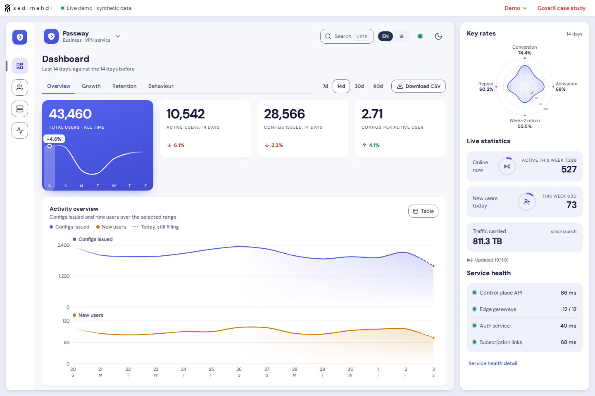 | 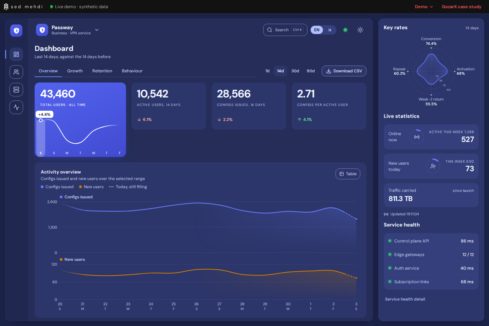 |
| Loopdesk (`saas`) | 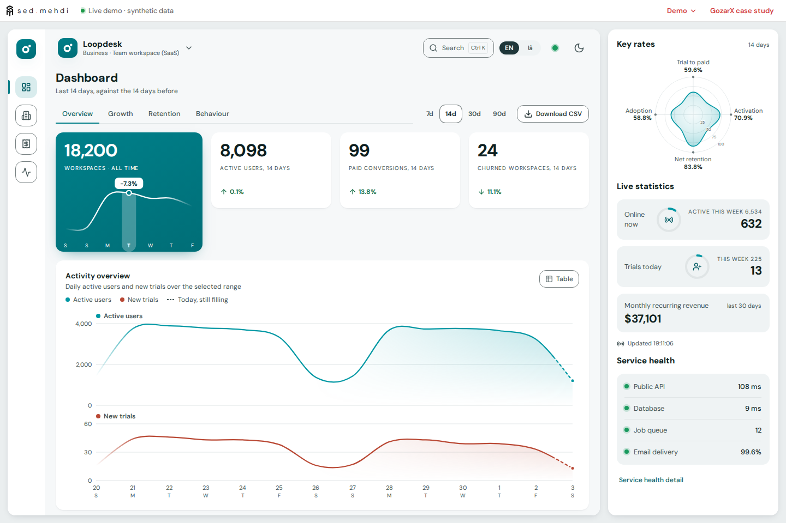 | 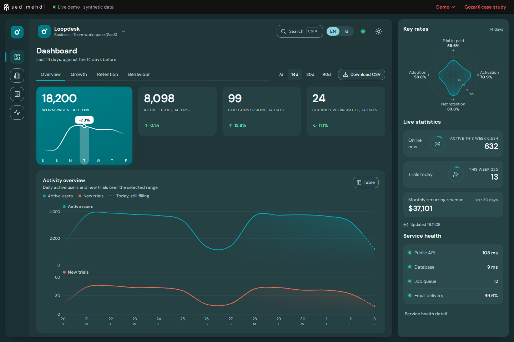 |
| Fernloft (`ecommerce`) | 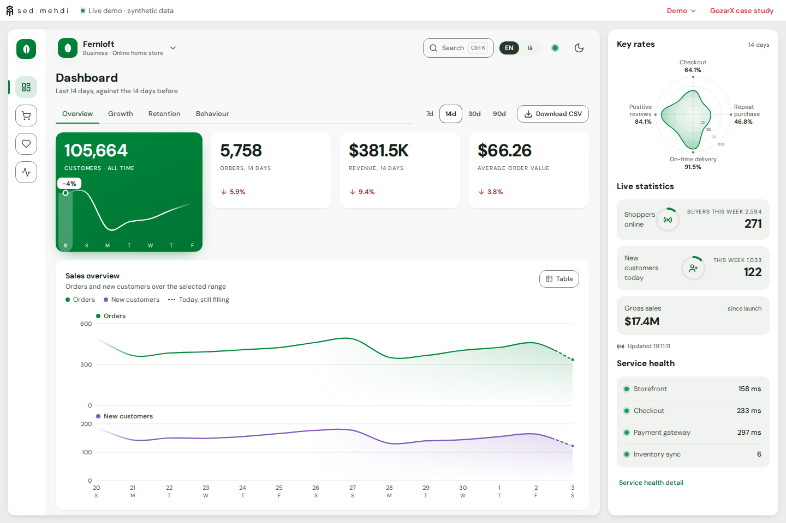 | 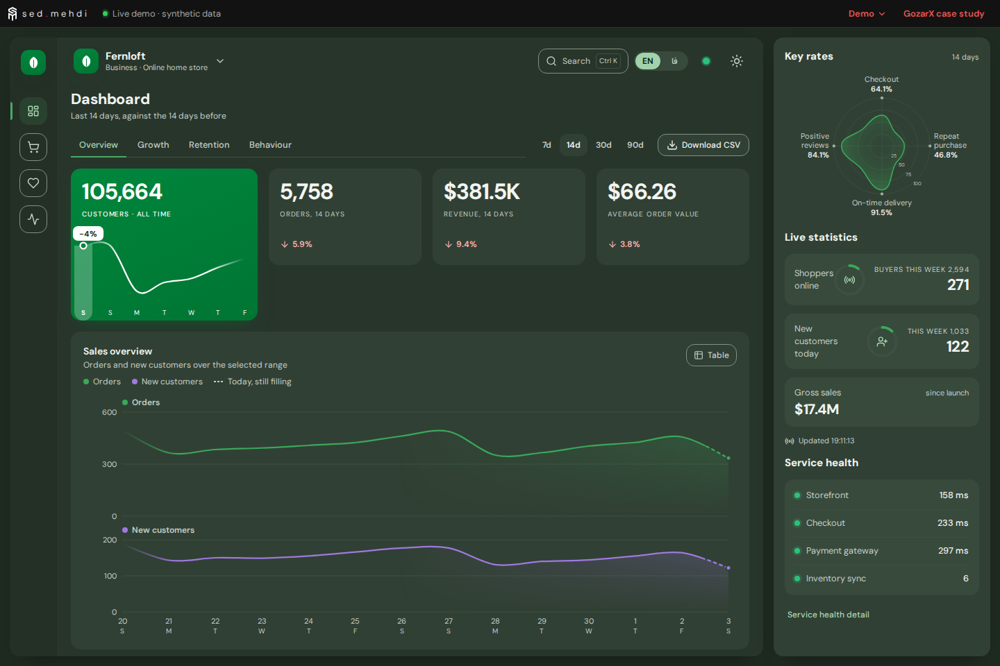 |
| Quillstone (`education`) | 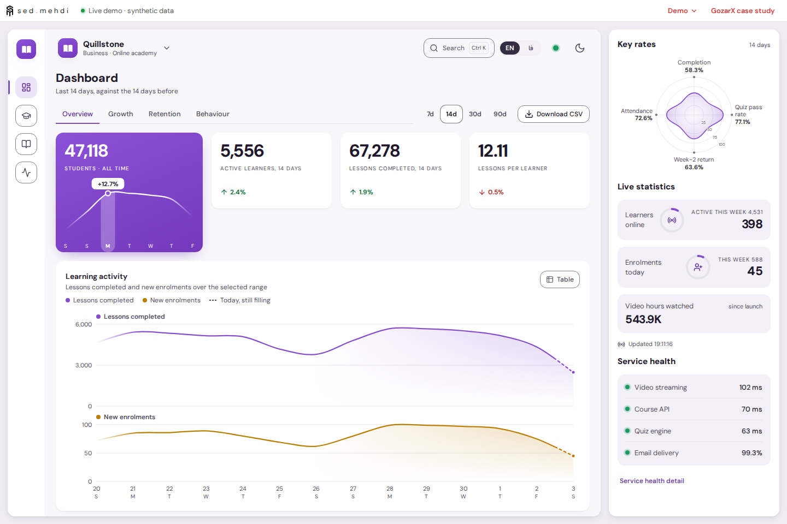 | 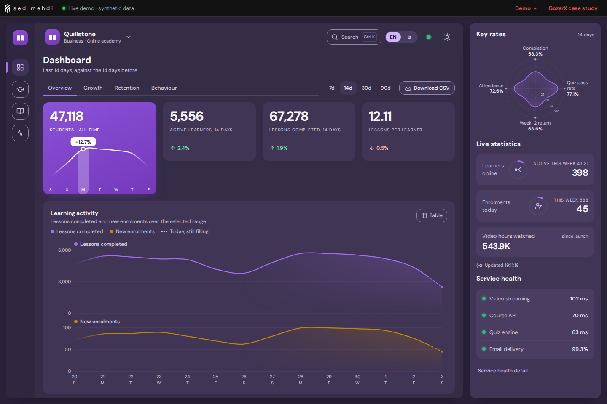 |
| Proofpost (`print`) | 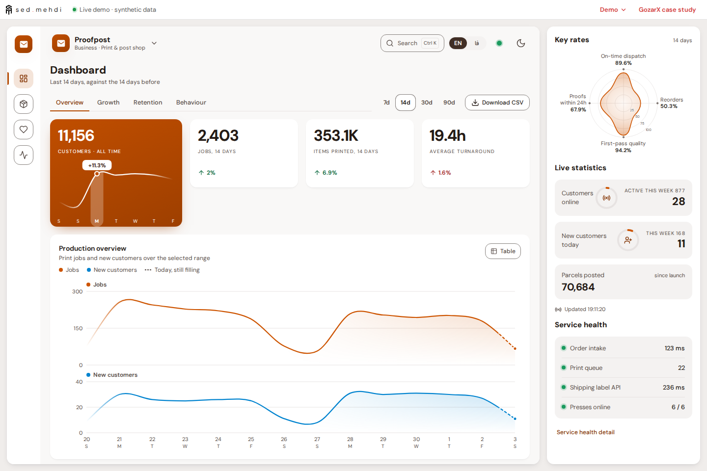 | 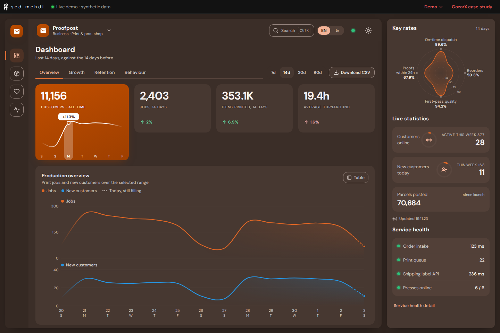 |

### عرض‌های دیگر، فارسی و پالت فرمان

| فایل | چه چیزی |
|---|---|
| [`vpn-768-dark.png`](screens/vpn-768-dark.png) | تبلت ۷۶۸، تیره: کاشی‌ها در دو ستون و کنترل بازه زیر زبانه‌ها؛ پنل کناری زیر محتوای داشبورد می‌آید (بیرون از قاب تصویر) |
| [`vpn-390-light.png`](screens/vpn-390-light.png)، [`vpn-390-dark.png`](screens/vpn-390-dark.png) | موبایل ۳۹۰ با نوار پایین |
| [`fa-rtl-1440-light.png`](screens/fa-rtl-1440-light.png) | فارسی/RTL در ۱۴۴۰ (Fernloft): چیدمان، نمودار و رقم‌ها آینه/فارسی |
| [`fa-rtl-390-dark.png`](screens/fa-rtl-390-dark.png) | فارسی/RTL در ۳۹۰، تیره |
| [`palette-open-1440-dark.png`](screens/palette-open-1440-dark.png) | پالت فرمان (Ctrl+K) با جستجوی «fern» |

| ۷۶۸ تیره | ۳۹۰ روشن | ۳۹۰ تیره | فارسی ۳۹۰ تیره |
|---|---|---|---|
| 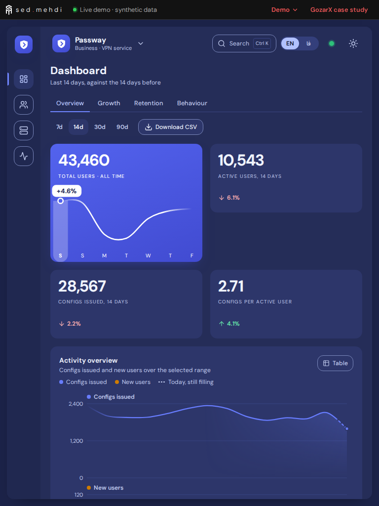 | 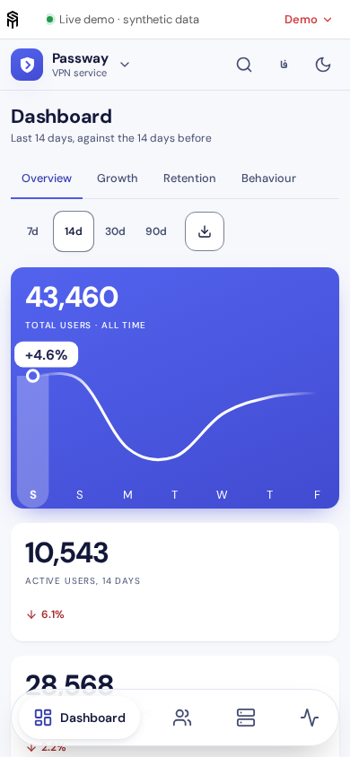 | 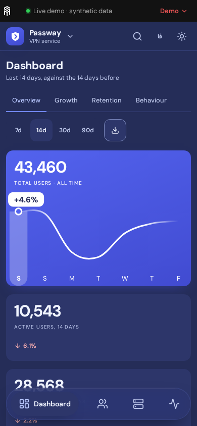 | 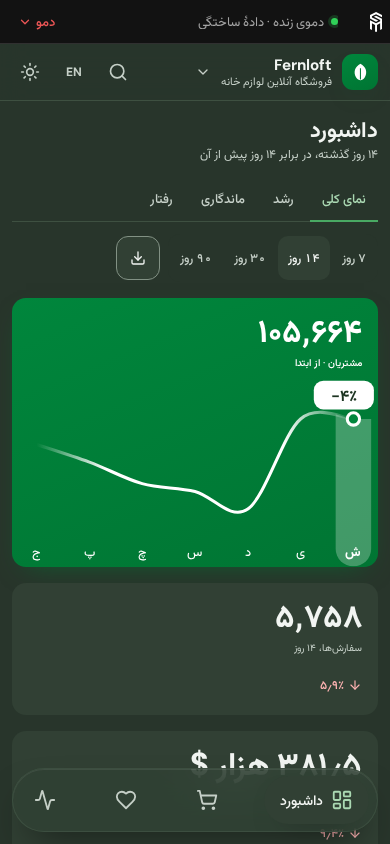 |

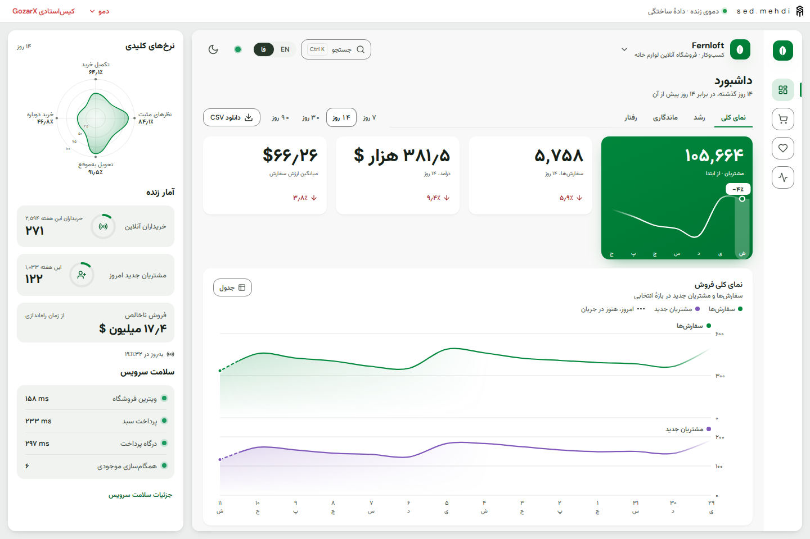

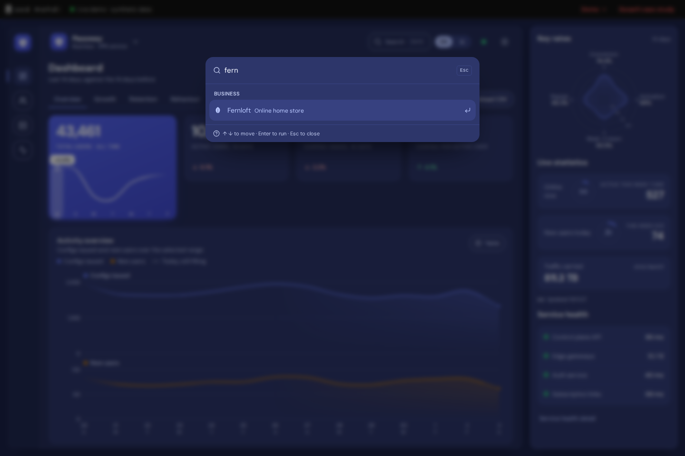

### بیشتر از فهرست خواسته‌شده

| فایل | چه چیزی |
|---|---|
| [`records-1440-light.png`](screens/records-1440-light.png) | جدول Accounts در Loopdesk: جستجو، فیلتر، وضعیت، مرتب‌سازی، CSV |
| [`health-1440-dark.png`](screens/health-1440-dark.png) | صفحهٔ سلامت Proofpost: بررسی‌ها، uptime نود روزه، رخدادها |
| [`growth-fa-1440-dark.png`](screens/growth-fa-1440-dark.png) | تب رشد Quillstone به فارسی |
| [`state-empty-1440-light.png`](screens/state-empty-1440-light.png) | حالت «فضای کاری خالی» از منوی دمو |
| [`state-error-1440-dark.png`](screens/state-error-1440-dark.png) | حالت «پاسخ‌های خطا» از منوی دمو، با Retry در هر بخش |
| [`portfolio-work-pill-1440-dark.png`](screens/portfolio-work-pill-1440-dark.png) | دکمهٔ «Live Demo» روی کارت GozarX در صفحهٔ Work |
| [`portfolio-case-button-390-light.png`](screens/portfolio-case-button-390-light.png) | دکمهٔ «Try the Live Demo» در کیس‌استادی GozarX، موبایل |
