# گزارش دور دوم: Spindle Admin Kit

در این دور سه کار انجام شد:

- **(الف) پروفایل سرور:** کسب‌وکار VPN از دمو کنار رفت و جایش Nodemill آمد، یک فروشندهٔ سرور ابری و مجازی.
- **(ب) پروژهٔ مستقل:** پنل مدیریت حالا در سایت پروژهٔ خودش است، با نام Spindle Admin Kit.
- **(ج) ممیزی و رفع باگ:** سایت و دمو در هشت عرض، دو تم و دو زبان ممیزی شدند. برای هر باگ اول تستی نوشته شد که روی وضعیت خراب شکست بخورد، بعد اصلاح آمد، بعد همان تست پاس شد.

یک ابزار هم اضافه شد: `npm run demo:single`، نسخهٔ تک‌فایلی دمو برای پیش‌نمایش آفلاین.

- **شاخه:** `feat/admin-demo`
- **PR:** [BoofKoor/sedmehdi#1](https://github.com/BoofKoor/sedmehdi/pull/1)
- **گزارش دور اول:** [REPORT-round1.md](REPORT-round1.md)
- **اجرای محلی:**
  1. `npm install`
  2. `npm run build`
  3. `python3 scripts/qa/serve.py dist 4321`
  4. باز کردن `http://localhost:4321/lab/admin/`

  کسب‌وکار پیش‌فرض Nodemill است و `?profile=vpn` هم همان را باز می‌کند. `serve.py` مثل nginx سایت برای مسیر ناموجود `404.html` را برمی‌گرداند.

---

## ۱. کامیت‌ها

ترتیب کامیت‌ها همان روش کار است: اول تست‌ها، بعد اصلاح‌ها. کامیت‌های میانی کد، از `9dbf093` تا `df8510d`، هر کدام در یک worktree جدا بررسی شدند (`tsc`، ۱۲۷ تست واحد و `astro build`) و همه سالم بودند. کامیت‌های بعدی یا فقط اسکریپت QA را عوض کرده‌اند یا روی همان درخت اصلی build و تست شده‌اند.

| کامیت | چه کرد |
|---|---|
| `a3c5f9f` | QA گسترده شد تا باگ‌ها را قبل از اصلاح ببیند. روی نسخهٔ قبل شکست می‌خورد (بخش ۳). |
| `9dbf093` | Nodemill جای کسب‌وکار VPN آمد؛ هر کسب‌وکار یک KPI پنجم گرفت؛ `?profile=vpn` به Nodemill می‌رود. |
| `a3f801a` | باگ‌های نمایشی دمو: B4، B5، B6، B8، B9، B10، B11 و جابه‌جایی شمارش عدد در فارسی. |
| `e1631dd` | پنل مدیریت پروژهٔ مستقل Spindle Admin Kit شد؛ pill و دکمهٔ «Live Demo» موبایل حذف شدند (B3 و B7 با آن‌ها رفتند). |
| `df8510d` | باگ‌های نمایشی سایت: B1، B2، B12 و B13. |
| `f9eba84` | `npm run demo:single` و تست آن روی `file://`. |
| `d97348b` | عنوان یک‌خطی کارت‌ها دوباره وسط کاشی لوگو قرار گرفت. این پسرفتِ اصلاح B12 بود و تست تازه‌اش اول روی کامیت قبلی شکست خورد. |
| `fb35476` | ممیزی حالا ellipsis داخل پنل اسکرول‌دار را هم می‌بیند. پیش از این B5 را روی دسکتاپ نمی‌دید (بخش ۹). |
| `fb2581b` | بررسی `entry` دیگر نوار پایین موبایل را لینکِ روی کارت نمی‌شمرد (بخش ۳). |
| `ada7da9` | بررسی `words` نگاشت `vpn` را به همان شکلی هم می‌شناسد که minifier می‌نویسد: ``{vpn:`hosting`}`` (بخش ۳). |
| `522b686` | گام فوکوس ممیزی بعد از هر Tab صبر می‌کند تا اسکرولی که عنصر را به دید می‌آورد تمام شود (بخش ۹). |
| (کامیت گزارش) | همین گزارش، اسکرین‌شات‌هایش و به‌روزرسانی READMEها. |

---

## ۲. باگ‌ها

ستون «تست» نام بررسی‌ای است که باگ را می‌گیرد. هر کدام روی وضعیت خراب شکست خورد و بعد از اصلاح پاس شد؛ عددها در بخش ۳ است. B12 و B13 در خود ممیزی پیدا شدند و در فهرست Phase 0 نبودند. B2′ و B12′ پسرفت اصلاح‌های خودم بودند که تست‌ها گرفتند.

| # | باگ | کجا | علت | اصلاح | تست | تصویر |
|---|---|---|---|---|---|---|
| B1 | کنتراست لینک‌ها روی کاشی‌های مشخصات در موبایل ۴٫۱۹:۱ بود (حداقل ۴٫۵) | کیس‌استادی‌ها، ≤۷۲۰، تم روشن | `--color-tint-text` (`#D33F41`) فقط روی سفید ۴٫۶۱ است و کاشی `#F4F4F4` است | توکن تم روشن `#C9393C` شد: ۵٫۰۸ روی سفید، ۴٫۶۲ روی `#F4F4F4` | `check_site.py` (`tokens_check`، لینک روی پس‌زمینهٔ دوم)؛ `audit.py` (`contrast`) | [قبل](screens-v2/bugs/B1-before.webp) · [بعد](screens-v2/bugs/B1-after.webp) |
| B2 | با Tab کارت دوم carousel فوکوس می‌گرفت ولی بیرون صفحه می‌ماند، با حلقهٔ فوکوسش، و نقطه‌ها هنوز کارت اول را نشان می‌دادند | Home، ۳۶۰ تا ۷۲۰ | Chromium عنصری را که کمی پیداست هنگام فوکوس اسکرول نمی‌کند | با `focusin`، یک فریم بعد، کارتی که هنوز کامل پیدا نیست وسط carousel می‌آید (با Reduce Motion بی‌انیمیشن) | `check_site.py` (`carousel_focus_check`: ۹ نقطهٔ `elementFromPoint` روی خود کارت، و نقطهٔ درست)؛ `audit.py` (`focus-hidden`) | [قبل](screens-v2/bugs/B2-before.webp) · [بعد](screens-v2/bugs/B2-after.webp) |
| B2′ | اصلاح اول B2 کارت سوم را در ۳۹۰، ۳۶۰ و ۳۲۰ بیرون صفحه گذاشت | Home، موبایل | اسکرولی که داخل خود رویداد focus صادر شود، اسکرول خود Chromium را لغو می‌کرد | اسکرول یک فریم صبر می‌کند و فقط کارتی را جابه‌جا می‌کند که هنوز کامل پیدا نیست | همان `carousel_focus_check`: ۱۶ خطا روی اصلاح اول، ۰ بعد | — |
| B3 | نقطهٔ سبز دکمهٔ «Live Demo» زیر کارت GozarX کنتراست ۲٫۰۲:۱ داشت (حداقل ۳) | Work، ≤۷۲۰، تم روشن | `#30D158` روی سفید | دکمه با pill حذف شد (بخش ۵) | `audit.py` (`ui-contrast`) | [قبل](screens-v2/bugs/B3-before.webp) · [بعد](screens-v2/bugs/B3-after.webp) |
| B4 | برچسب روز علامت‌خورده در sparkline کاشی اصلی کنتراست ۳٫۰۳ تا ۳٫۱۵:۱ داشت | داشبورد دمو، همهٔ کسب‌وکارها، هر دو زبان و تم | نوار سفید ۲۶٪ زیر روز علامت‌خورده تا پایین قاب می‌رفت و ردیف برچسب‌ها را هم می‌پوشاند | نوار ۱۴ پیکسل بالای خط پایهٔ برچسب‌ها تمام می‌شود | `audit.py` (`contrast`، با شکل SVG زیر متن SVG)؛ `check_admin_demo.py` (`phone_a11y`) | [قبل](screens-v2/bugs/B4-before.webp) · [بعد](screens-v2/bugs/B4-after.webp) |
| B5 | نام اول کارت «Top course» با «…» بریده می‌شد («Data Analysis with P…») | دمو، آکادمی، ۱۰۲۴ | `truncate` روی همان متنی که کارت درباره‌اش است | متن می‌شکند (`overflow-wrap: anywhere`) | `audit.py` (`clipped`)؛ از `fb35476` به بعد روی دسکتاپ هم (بخش ۹) | [قبل](screens-v2/bugs/B5-before.webp) · [بعد](screens-v2/bugs/B5-after.webp) |
| B6 | عنصر فوکوس‌شده تا یک‌سوم زیر نوار پایین می‌رفت (مثلاً نمودار روند) | دمو، زیر ۷۶۸ (ممیزی در ۷۲۰، ۳۹۰ و ۳۲۰ دیدش) | دمو `scroll-padding` نداشت؛ سایت داشت | `scroll-padding-top` و `scroll-padding-bottom` به اندازهٔ هدر و نوار پایین، به‌اضافهٔ safe-area | `audit.py` (`focus-partly-hidden` و `REACH`) | [قبل](screens-v2/bugs/B6-before.webp) · [بعد](screens-v2/bugs/B6-after.webp) |
| B7 | ناحیهٔ کلیک pill «Live Demo» داخل ناحیهٔ کلیک کارت GozarX بود | Work، ≥۷۲۱ | pill لایه‌ای جدا روی کارت بود | pill حذف شد | `audit.py` (`hit-overlap`)؛ `check_admin_demo.py` (`entry`) | [قبل](screens-v2/bugs/B7-before.webp) · [بعد](screens-v2/bugs/B7-after.webp) |
| B8 | مقدارهای کارت ردیف‌ها بریده می‌شد («Web Development Boo…»، «Dunmore Consulti…») | دمو، جدول‌ها، ۳۹۰ و ۳۲۰ | `truncate` در شبکهٔ دوستونهٔ کارت | مقدار و نام و handle شخص می‌شکنند؛ پنجرهٔ رکورد هم | `audit.py` (`clipped`) | [قبل](screens-v2/bugs/B8-before.webp) · [بعد](screens-v2/bugs/B8-after.webp) |
| B9 | زیرعنوان کسب‌وکار در نوار بالا بریده می‌شد («Team worksp…») | دمو، ۳۲۰ | `truncate` | زیرعنوان زیر نام می‌شکند؛ فهرست انتخاب‌گر هم | `audit.py` (`clipped`) | [قبل](screens-v2/bugs/B9-before.webp) · [بعد](screens-v2/bugs/B9-after.webp) |
| B10 | برچسب تب باز نوار پایین بریده می‌شد («Dashbo…») | دمو، ۳۲۰ | سقف عرض `6.5rem` | سقف برداشته شد. زیر ۳۶۰ پیکسل فاصله‌ها کمتر و فونت ۱۳ پیکسل است و هر تب بستهٔ همچنان ۴۴ پیکسل جا دارد | `audit.py` (`clipped` و `target`) | [قبل](screens-v2/bugs/B10-before.webp) · [بعد](screens-v2/bugs/B10-after.webp) |
| B11 | نام قدم‌های قیف بریده می‌شد («Started a …»، «Complete…») | دمو، Growth، ۳۲۰ | `truncate`؛ عدد و «of the step before» جای نام را می‌گرفتند | نام می‌شکند؛ عدد و زیرنویس وقتی جا نیست به خط خودشان می‌روند | `audit.py` (`clipped`) | [قبل](screens-v2/bugs/B11-before.webp) · [بعد](screens-v2/bugs/B11-after.webp) |
| CLS | عدد در حال شمارش در فارسی هر فریم یک جابه‌جایی ثبت می‌کرد: ۰٫۰۰۹۰ تا ۰٫۰۱۰۲ در بارگذاری | دمو، فارسی، ۳۹۰ | امتیاز layout shift از گوشهٔ بالا-چپ جعبهٔ متن حساب می‌شود و عدد راست‌چین به چپ رشد می‌کرد | لایهٔ عدد متحرک به لبهٔ چپ جعبه سنجاق شد: به راست رشد می‌کند و دقیقاً روی عدد نهایی تمام می‌شود | `check_admin_demo.py` (`layout`: بیش از ۰٫۰۰۵ در فارسی شکست است)؛ `audit.py` (`CLS`) | — |
| B12 | فلش بعد از عنوان بلند «Spindle Admin Kit» تا ۲۷۰ پیکسل دورتر از متن می‌افتاد، وسط ارتفاع کل بلوک | کارت‌های Spindle در Home و Work، کارت «پروژهٔ بعدی»، همهٔ عرض‌ها | عنوان یک ردیف flex بود؛ متنِ شکسته تمام عرض ردیف را می‌گرفت و فلش را به انتها می‌راند | عنوان متن معمولی با `text-wrap: balance` شد. آخرین کلمه و فلش یک جعبهٔ نشکن‌اند: «Spindle / Admin Kit ›» | `check_site.py` (`title_arrow_check`: فلش حداکثر ۲۴ پیکسل بعد از آخرین خط و روی همان خط) | [قبل](screens-v2/bugs/B12-before.webp) · [بعد](screens-v2/bugs/B12-after.webp) |
| B12′ | بعد از اصلاح B12، عنوان یک‌خطی ۹ پیکسل (۱۴۴۰) تا ۱۷٫۵ پیکسل (۷۶۸) بالاتر از وسط کاشی لوگو بود | کارت‌های stack دسکتاپ | عنوانی که متن معمولی شده بود به بالای ردیف لوگو چسبید | عنوان در ردیف خودش وسط‌چین شد (`align-self: center`) | `check_site.py` (`title_logo_check`) | — |
| B13 | متن کارت‌های stack پایین کارت بریده می‌شد. روی گوشی افقی (۸۴۴×۳۹۰) کارت ۱۷۴ پیکسل بود و متنش ۴۵۰ پیکسل جا می‌خواست، پس جز عنوان چیزی دیده نمی‌شد. در ۷۲۱ چیپ‌های کارت Spindle ۳۰ پیکسل بیرون می‌زد | Home و Work؛ گوشی افقی، پنجره‌های کوتاه و ۷۲۱ تا ۱۰۲۳ | ارتفاع کارت چسبان برابر ارتفاع صفحه منهای نوار و فاصله‌های stack است، هرقدر هم کم باشد؛ بین ۷۲۱ تا ۱۰۲۳ ستون متن از تصویر باریک‌تر بود | بین ۷۲۱ تا ۱۰۲۳ ستون متن پهن‌تر از تصویر شد. زیر ارتفاع 42.5em (۶۸۰ پیکسل با فونت پیش‌فرض) کارت‌ها دیگر نمی‌چسبند و به اندازهٔ متنشان‌اند. خلاصهٔ Spindle کوتاه‌تر شد | `check_site.py` (`card_fit_check`، از ۲۵۶۰ تا گوشی افقی ۸۱۲×۳۷۵) | ۷۲۱: [قبل](screens-v2/bugs/B13-721-before.webp) · [بعد](screens-v2/bugs/B13-721-after.webp)؛ گوشی افقی: [قبل](screens-v2/bugs/B13-844x390-before.webp) · [بعد](screens-v2/bugs/B13-844x390-after.webp) |

B13 فقط مال کارت Spindle نبود. روی نسخهٔ قبل هم بود: کارت GozarX روی گوشی افقی و در ۷۶۸×۷۲۰ و همهٔ کارت‌ها در ۷۲۱×۶۴۰ بریده می‌شدند (۳۶ خطای `card_fit_check` روی نسخهٔ قبل). سه چیز پیدایش کرد:

- عنوان دوخطی Spindle؛
- خلاصهٔ بلندترش؛
- یک بررسی که ارتفاع صفحه را هم عوض می‌کند، نه فقط عرض را.

### تصویرهای قبل و بعد

| | قبل | بعد |
|---|---|---|
| B1: لینک‌ها روی کاشی‌های مشخصات (۳۹۰، روشن) |  | 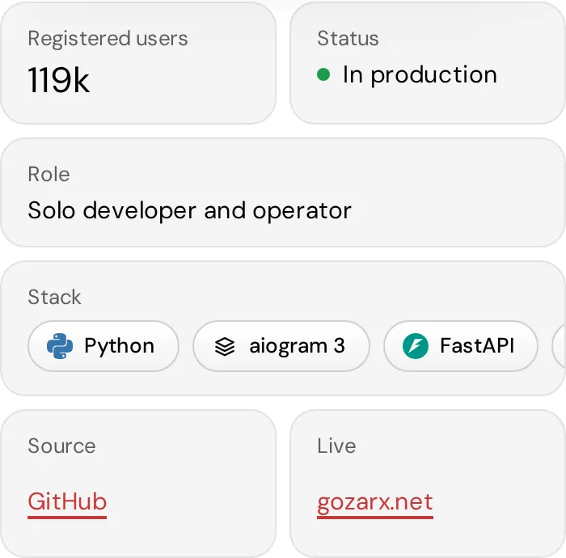 |
| B2: Tab روی کارت دوم carousel (۷۲۰) | 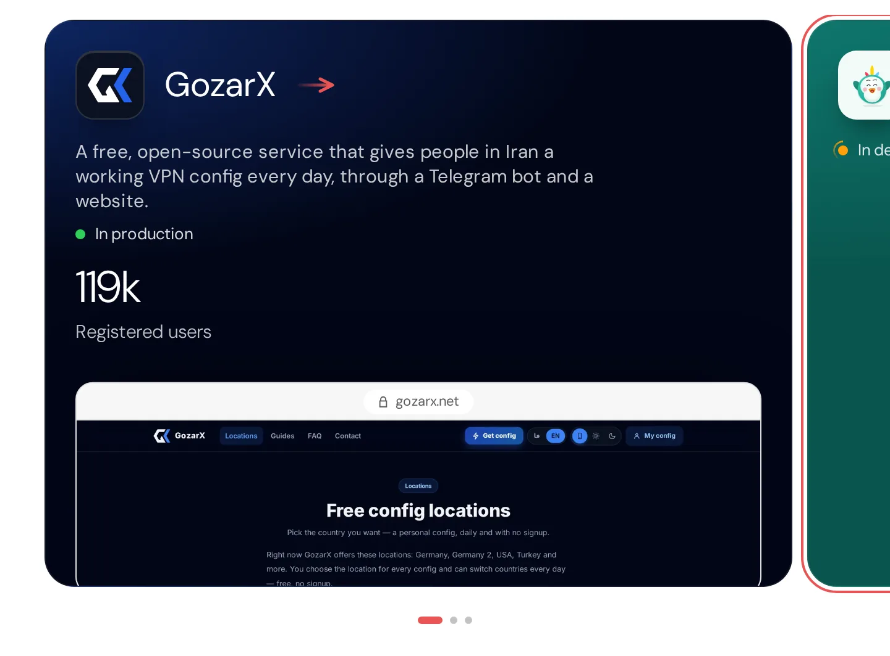 | 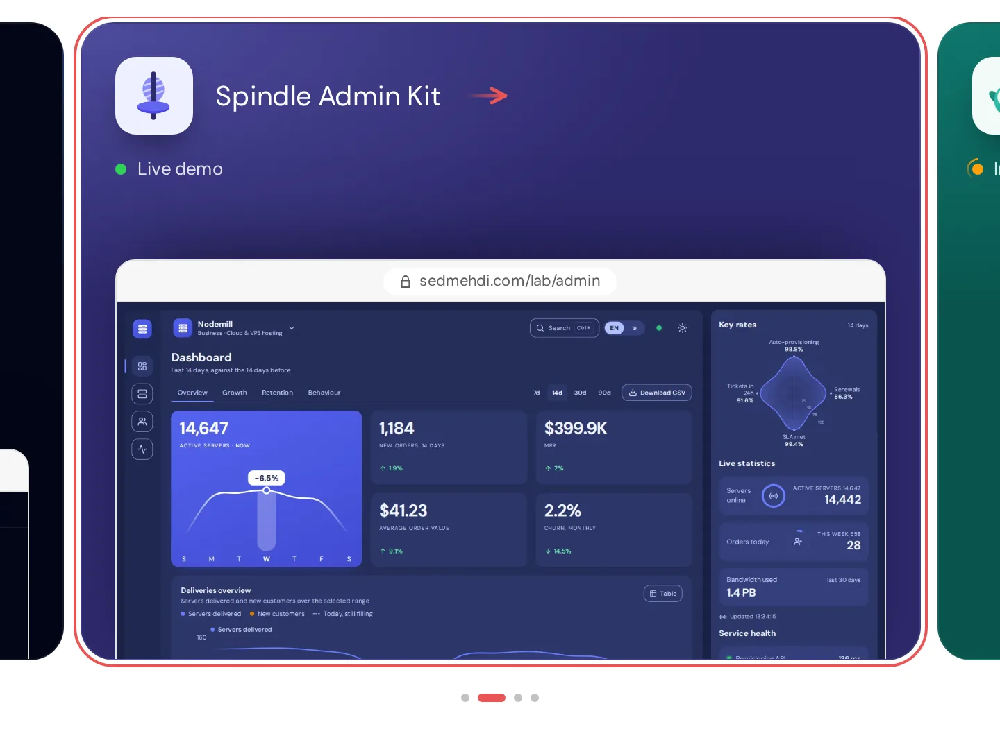 |
| B3: دکمهٔ «Live Demo» و نقطه‌اش زیر کارت GozarX (۳۹۰، روشن) | 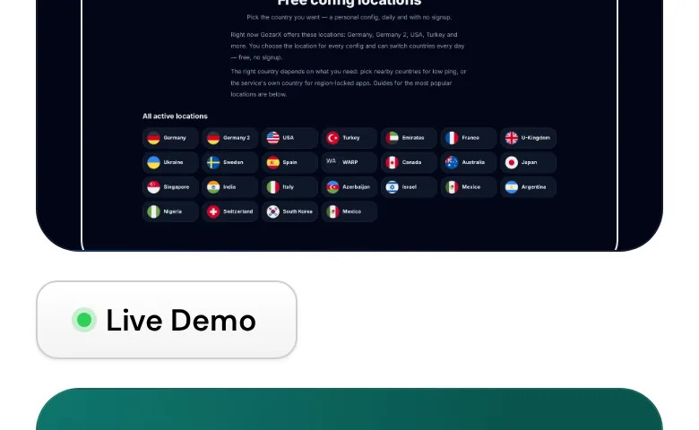 | 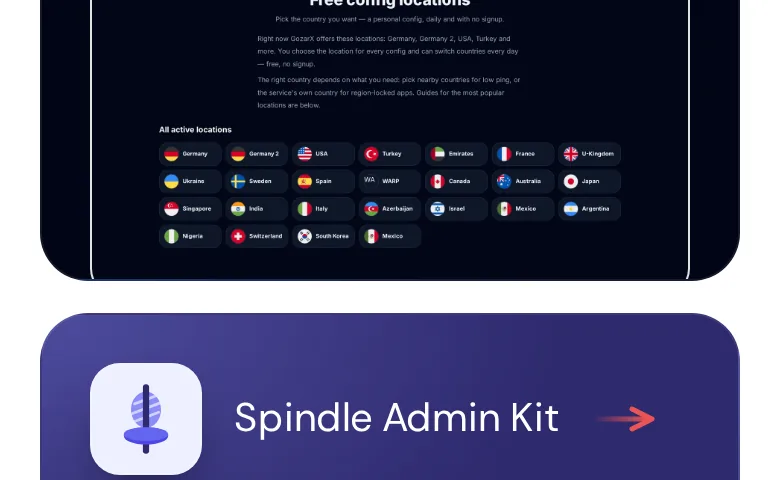 |
| B4: برچسب روز علامت‌خورده روی نوار sparkline (۳۹۰) | 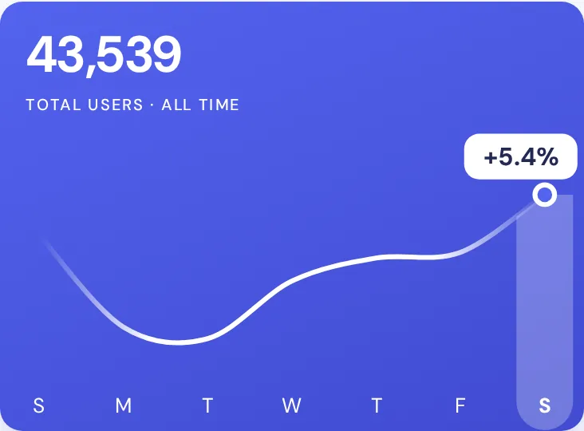 | 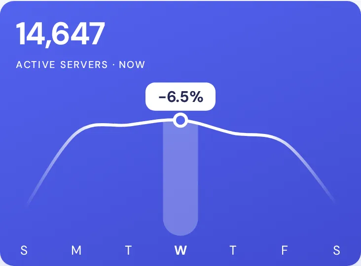 |
| B5: کارت «Top course» (۱۰۲۴، آکادمی) | 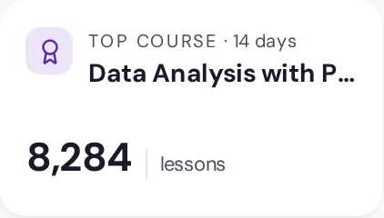 | 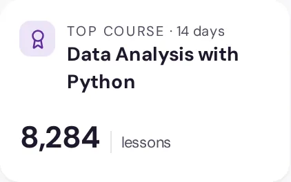 |
| B6: نمودار فوکوس‌شده و نوار پایین (۳۹۰) | 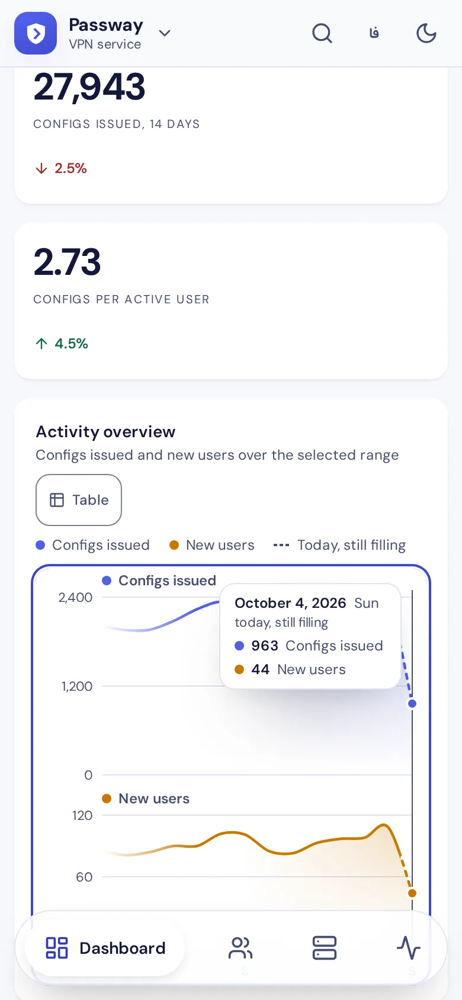 | 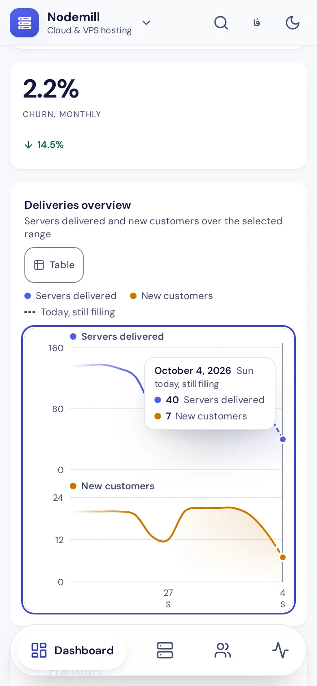 |
| B7: pill روی کارت GozarX (۱۴۴۰، تیره) | 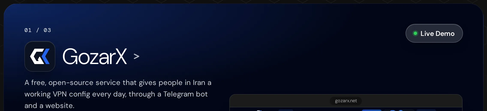 | 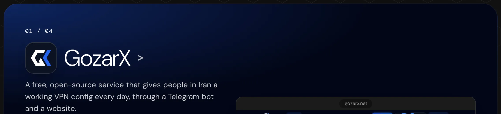 |
| B8: کارت یک ردیف دانشجو (۳۹۰) | 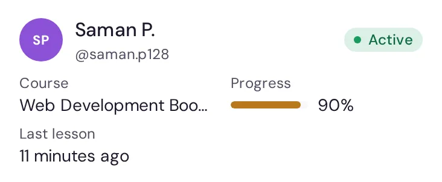 | 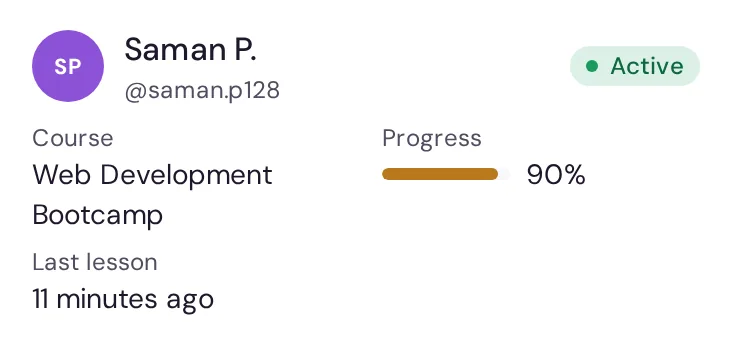 |
| B9: زیرعنوان کسب‌وکار (۳۲۰، SaaS) | 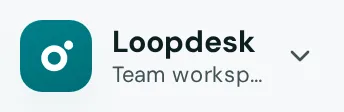 | 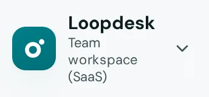 |
| B10: تب باز نوار پایین (۳۲۰) | 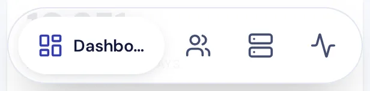 | 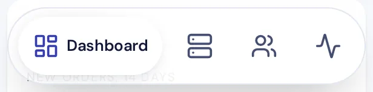 |
| B11: قیف یادگیری (۳۲۰، آکادمی) | 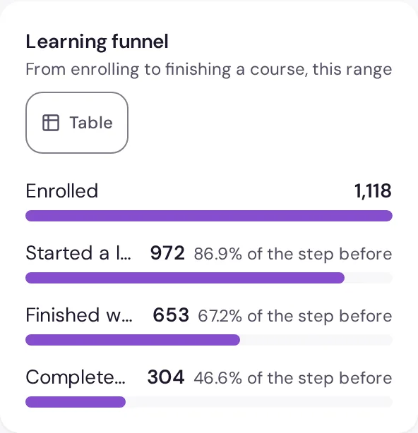 | 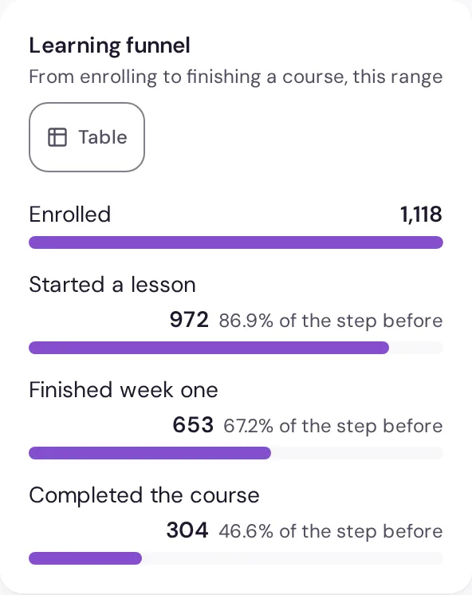 |
| B12: عنوان و فلش کارت Spindle (۱۴۴۰، تیره) | 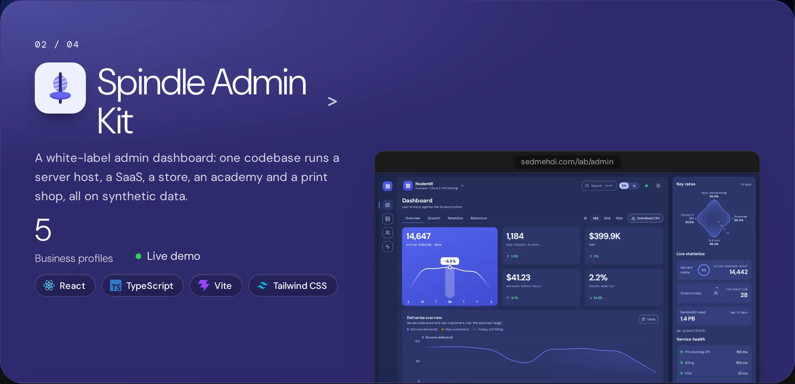 | 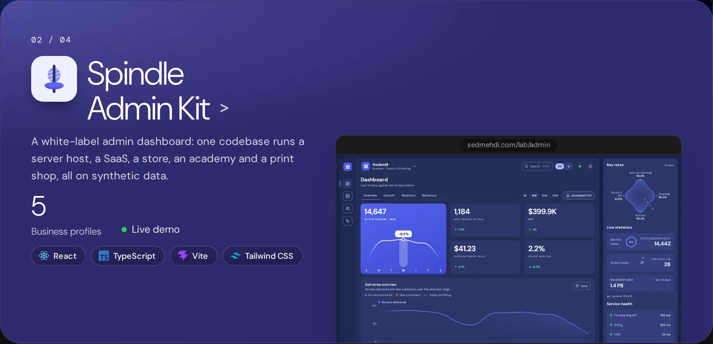 |
| B13: کارت Spindle در ۷۲۱×۹۰۰ | 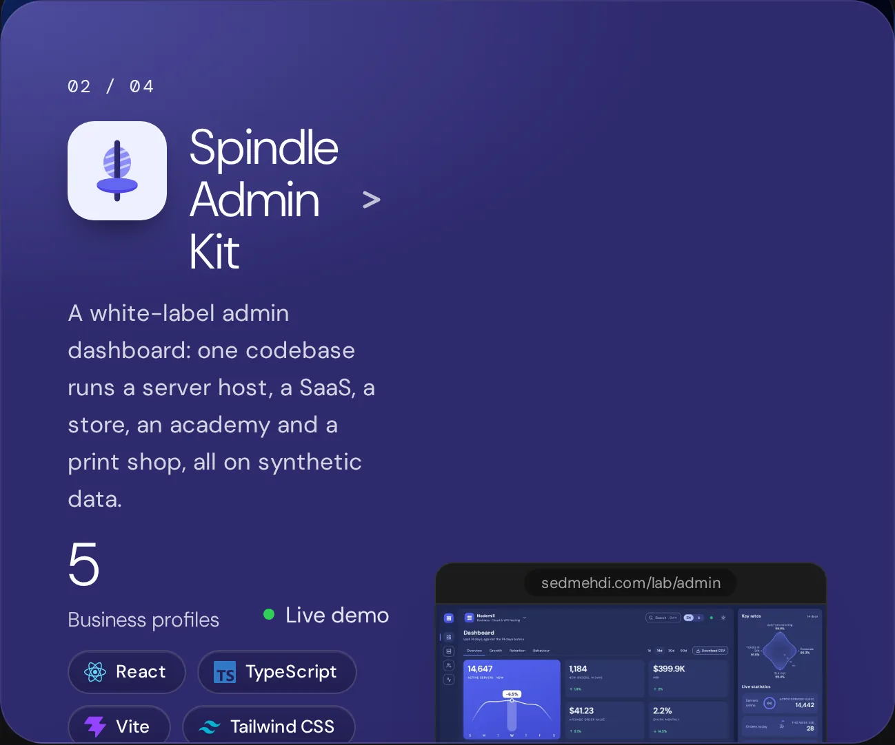 | 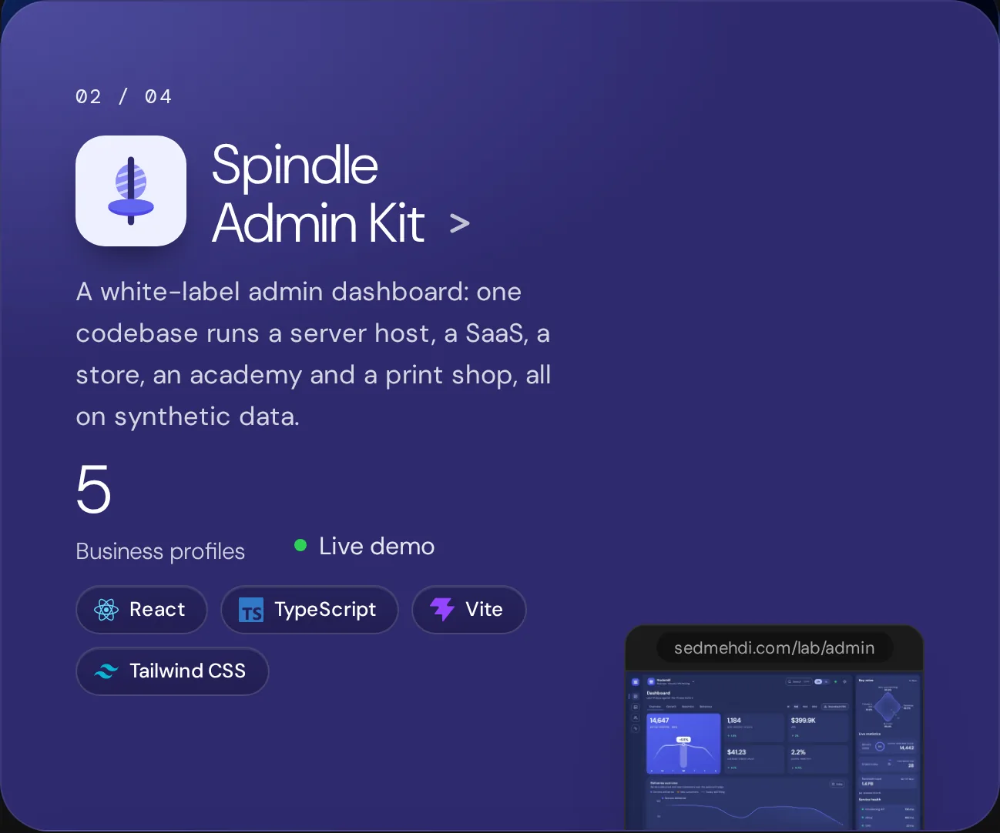 |
| B13: کارت GozarX روی گوشی افقی ۸۴۴×۳۹۰ (نوار بالای سایت برای عکس پنهان شده) | 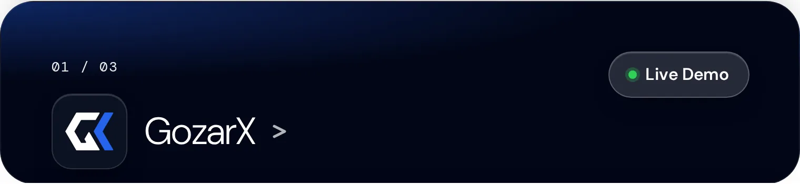 | 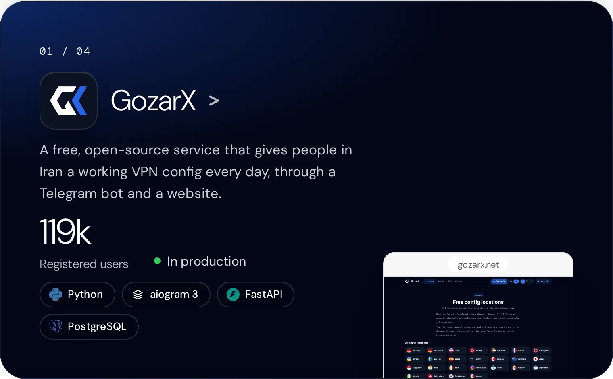 |

---

## ۳. QA: قبل و بعد

### سه اجرا

| اجرا | کد | QA |
|---|---|---|
| QA قدیم، نسخهٔ قبل | `cbdb281`، سر PR پیش از این دور | اسکریپت‌های همان کامیت |
| QA جدید، نسخهٔ قبل | `cbdb281` | اسکریپت‌های این دور (`a3c5f9f` به بعد) |
| QA جدید، نسخهٔ نهایی | سر شاخه | اسکریپت‌های این دور |

- **خروجی‌ها:** هر سه اجرا کامل نگه داشته شده‌اند.
- **جدا کردن اجراها:** هر فرمان زیر ۳۰۰ ثانیه ماند. ممیزی برای همین به هر عرض جدا تقسیم شد: ۸ اجرا برای سایت و ۱۶ برای دمو (عرض در تم). `check_admin_demo.py` هم در ۶ گروه اجرا شد.
- **سرور:** `serve.py` با `404.html`، مثل nginx.

### اسکریپت به اسکریپت

| اسکریپت | QA قدیم، نسخهٔ قبل | QA جدید، نسخهٔ قبل | QA جدید، نسخهٔ نهایی |
|---|---|---|---|
| `npm run test:demo` | ۱۰۵ تست در ۴ فایل، همه موفق | — (تست‌های تازه به Nodemill نیاز دارند و روی کد قبلی کامپایل نمی‌شوند) | **۱۲۷ تست در ۵ فایل، همه موفق** |
| `check_site.py` | ۰ خطا | **۶۲ خطا** (جدول پایین) | **۰ خطا** |
| `check_single.py` | ۰ خطا | همان اسکریپت؛ در این دور تغییر نکرد | **۰ خطا**، ۰ درخواست مسدود |
| `check_single_phone.py` | ۰ خطا | ۰ خطا | **۰ خطا** |
| `check_admin_demo.py` | ۱۵ بررسی، همه موفق، هر کدام با `--prove` | **۸ از ۱۷ بررسی شکست** (`numbers` اجرا نشد؛ کیس‌استادی هنوز نبود) | **۱۸ از ۱۸ موفق**، هر کدام اول روی صفحهٔ خراب شکست خورد |
| `audit.py` | ۱۹ مورد: ۱۵ نقطهٔ لوگوتایپ، B1 روی GozarX، خطای خود صفحهٔ ۴۰۴، و چند هدف ۴۴ پیکسلی ناپایدار | **سایت ۱۱ و دمو ۳۱۸ مورد یکتا (جدول پایین)** | **سایت ۰ و دمو ۰، در ۸ اجرای سایت و ۱۶ اجرای دمو** |
| `check_demo_single.py` | — (جدید) | — | **موفق**؛ با `--prove` روی هر دو نسخهٔ خراب شکست خورد |

سه نکته دربارهٔ این جدول:

- **ستون «QA قدیم، نسخهٔ قبل»:** QA قدیم روی نسخهٔ قبل همه‌جا سبز بود جز ممیزی. یعنی B1 تا B11 از چشمش افتاده بودند و فقط ممیزی قدیم B1 را می‌دید.
- **`audit.py` قدیم:** نقطهٔ لوگوتایپ را خطا می‌شمرد. ممیزی جدید آن را طبق WCAG 1.4.3 استثنا می‌کند.
- **هدف‌های ناپایدار:** «هدف‌های ۴۴ پیکسلی ناپایدار» یک گردکردن زیرپیکسلی در ممیزی قدیم بود. ممیزی جدید عرض و ارتفاع را گرد می‌کند و این مورد دیگر پیش نمی‌آید.

### هر بررسی کدام باگ را گرفت

**`check_site.py` روی نسخهٔ قبل (`cbdb281`) و نهایی، بررسی به بررسی:**

| بررسی | نسخهٔ قبل | نهایی | چه را می‌گیرد |
|---|---|---|---|
| `tokens_check` | ۱ | ۰ | B1: لینک روی پس‌زمینهٔ دوم، ۴٫۱۹:۱ |
| `carousel_focus_check` | ۱۲ | ۰ | B2: ۳۶۰ تا ۷۲۰، با Reduce Motion و بدون آن |
| `card_fit_check` | ۳۶ | ۰ | B13: کارت‌های GozarX، Tooti و Jozveyar روی گوشی افقی و پنجره‌های کوتاه |
| `order_check` | ۹ | ۰ | ترتیب، شماره‌ها، نقطه‌ها و زنجیرهٔ چهار پروژه؛ پروژهٔ چهارم هنوز نبود |
| `mobile_check` | ۴ | ۰ | صفحهٔ Spindle و «پروژهٔ بعدی» GozarX؛ هنوز نبودند |
| `title_arrow_check` | ۰؛ ۱۷ روی `e1631dd` | ۰ | B12؛ فقط با عنوان بلند Spindle پیدا شد |
| `title_logo_check` | ۰؛ ۳۰ روی `df8510d` | ۰ | B12′ |
| `hero_check`، `grid_check`، `stack_check` و بررسی‌های صفحه‌ای (سرریز، h1، هدف‌ها، هدر، فونت، میزبان دیگر، خطای JS) | ۰ | ۰ | بدون تغییر |

**`check_admin_demo.py` روی نسخهٔ قبل و نهایی:**

| بررسی | نسخهٔ قبل | نهایی (با `--prove`) |
|---|---|---|
| `hosts` | موفق | موفق |
| `render` | **شکست** (۲۰ مورد): چهار عدد به‌جای پنج، در هر کسب‌وکار و هر بازه | موفق |
| `csv` | **شکست**: کسب‌وکار Nodemill و `[data-top-head]` نبودند | موفق |
| `palette`، `theme_lang`، `overflow`، `motion`، `bundle`، `keyboard`، `names`، `labels` | موفق | موفق |
| `phone_a11y` | **شکست** (۲۴ مورد): B4 («S» ۳٫۰۳:۱ تا «د» ۳٫۱۵:۱، ۳۹۰، هر دو تم) | موفق |
| `entry` | **شکست** (۱۸ مورد): کارت دوم Tooti بود، ۳ pill روی کارت‌ها، B7 (pill روی کارت GozarX در ۱۴۴۰ و ۱۰۲۴)، بدون دکمهٔ دمو | موفق |
| `persist` | **شکست**: `?profile=vpn` همان VPN را باز کرد | موفق |
| `layout` | **شکست**: CLS بارگذاری فارسی ۰٫۰۰۹۰ (فروشگاه) و ۰٫۰۱۰۲ (چاپخانه) در ۳۹۰ | موفق |
| `words` | **شکست**: ۷۳ مورد. ۱۴ در فایل‌های ساخته‌شده، ۳۵ در متن صفحه‌ها، ۱۳ در CSVها، ۷ در پنجرهٔ رکوردها و ۴ در پالت و انتخاب‌گر («VPN»، «config»، «trial»، «کانفیگ»، «آزمایشی» و…) | موفق |
| `kpis` | **شکست** (۱۵ مورد): چهار عدد به‌جای پنج، در ۱۴۴۰، ۷۶۸ و ۳۹۰ | موفق |
| `numbers` | — | موفق: ۱۰۴٫۱ KB، ۱۲۷ تست، ۱۸ بررسی |

اجرای اول `entry` روی نسخهٔ نهایی شکست خورد: «links drawn over a card: Home, Work, About». این خطا از خود بررسی بود. نوار پایین موبایل عمداً روی کارت‌ها شناور است و بررسی آن را لینکِ روی کارت می‌شمرد. اصلاح شد (`fb2581b`): نوارهای خود سایت کنار گذاشته می‌شوند. بررسی همچنان روی نسخهٔ قبل B7 را می‌گیرد. گروه ۳ دوباره با `--prove` اجرا شد و موفق بود.

اجرای اول `words` روی نسخهٔ نهایی هم شکست خورد: «"vpn" in the built file». این هم خطای خود بررسی بود. الگوی استثنای نگاشت `vpn → hosting` فقط گیومهٔ تکی و جفتی را می‌پذیرفت، ولی minifier رشته را با backtick می‌نویسد. اصلاح شد (`ada7da9`) و گروه ۶ دوباره با `--prove` اجرا شد و موفق بود. هر `vpn` دیگری همچنان شکست است.

**`audit.py` روی نسخهٔ قبل و نهایی:**

شمارش بر اساس «مورد یکتا» است: هر ترکیب نوع، صفحه و متن یک بار شمرده می‌شود، هرقدر هم در عرض‌ها، تم‌ها و زبان‌ها تکرار شود. هر دو طرف با همان نسخهٔ نهایی `audit.py` اجرا شدند: ۸ اجرای سایت و ۱۶ اجرای دمو (هر عرض در هر تم)، و در دمو هر پنج کسب‌وکار در هر دو زبان.

| بخش | نوع | نسخهٔ قبل | نهایی | باگ |
|---|---|---|---|---|
| سایت | `contrast`: کنتراست متن روی پس‌زمینهٔ واقعی | ۶ | ۰ | B1 |
| سایت | `ui-contrast`: کنتراست اجزای غیرمتنی (نقطهٔ وضعیت) | ۱ | ۰ | B3 |
| سایت | `hit-overlap`: ناحیهٔ کلیک روی ناحیهٔ کلیک دیگر | ۱ | ۰ | B7 |
| سایت | `http`: پاسخ غیر ۲۰۰ (صفحهٔ Spindle هنوز نبود) | ۱ | ۰ | — |
| سایت | `focus-hidden`: فوکوس کاملاً پنهان یا بیرون صفحه | ۱ | ۰ | B2 |
| سایت | `js-error`: خطای کنسول (همان ۴۰۴ صفحهٔ Spindle) | ۱ | ۰ | — |
| **سایت، جمع** | | **۱۱** | **۰** | |
| دمو | `focus-partly-hidden`: فوکوس تا حدی زیر نوار ثابت | ۲۰۸ | ۰ | B6 |
| دمو | `clipped`: متن بریده یا ellipsis | ۱۰۰ | ۰ | B5، B8، B9، B10، B11 |
| دمو | `contrast`: کنتراست متن روی پس‌زمینهٔ واقعی | ۱۰ | ۰ | B4 |
| **دمو، جمع** | | **۳۱۸** | **۰** | |

- **۲۰۸ مورد `focus-partly-hidden` (B6):** ردیف‌های جدول، نمودار روند و کارت‌ها در ۷۲۰، ۳۹۰ و ۳۲۰. با Tab زیر نوار پایین می‌رفتند و ۳ یا ۶ نقطه از ۹ نقطه‌شان پنهان می‌ماند.
- **۱۰۰ مورد `clipped`:**
  - ۶۴ مورد B9 و B8: زیرعنوان کسب‌وکار و مقدار کارت ردیف‌ها؛
  - ۲۴ مورد B10: برچسب تب باز نوار پایین؛
  - ۱۰ مورد B11: نام قدم‌های قیف؛
  - ۲ مورد B5: نام برتر کارت top، در ۱۰۲۴ و ۱۴۴۰. این دو را فقط ممیزی اصلاح‌شده (`fb35476`) می‌بیند.
- **۱۰ مورد `contrast` در دمو (B4):** یک برچسب روز در هر کسب‌وکار و هر زبان، که در همهٔ عرض‌ها و هر دو تم تکرار می‌شد.
- **سایت:**
  - ۶ لینک کیس‌استادی‌ها (B1)؛
  - نقطهٔ دکمهٔ Live Demo (B3)؛
  - pill روی کارت (B7)؛
  - کارت Tooti بیرون صفحه با فوکوس (B2)؛
  - و ۴۰۴ صفحهٔ Spindle که هنوز وجود نداشت.
- **ممیزی قدیم روی همین نسخه** فقط ۱۹ مورد گزارش کرد و از این‌ها فقط B1 در آن بود.

---

## ۴. پروفایل Nodemill (فروش سرور)

- **شناسه:** `hosting`.
- **برند:** Nodemill.
- **نوع کسب‌وکار:** «Cloud & VPS hosting» / «سرور مجازی و ابری».
- **لوگو:** سه اسلب سرور، با چراغ و شکاف درایو بریده‌شده از آن‌ها.
- **پیش‌فرض:** Nodemill حالا کسب‌وکار پیش‌فرض دمو است.
- **شناسهٔ قدیمی:** `?profile=vpn` و `vpn` ذخیره‌شده در مرورگر Nodemill را باز می‌کنند. این نگاشت هم در `src/profiles/brands.ts` (`LEGACY_PROFILES`) است و هم در اسکریپت پیش از رنگ‌آمیزی `index.html`. یک تست واحد این دو را با هم برابر نگه می‌دارد.

### KPIها

| KPI | از کجا |
|---|---|
| **سرورهای فعال** (قهرمان، «اکنون») | سرورهای تحویل‌شده منهای حذف‌شده‌ها از روز راه‌اندازی، تا خود واحد |
| **سفارش‌های جدید، N روز** | جریان سفارش |
| **MRR** | سرورهای فعال × میانگین وزنی قیمت ماهانهٔ پلن‌ها (۵٫۹ تا ۱۸۹ دلار) |
| **میانگین ارزش سفارش** | درآمد ÷ سفارش |
| **ریزش ماهانه** | مشتریان از دست رفته در بازه ÷ مشتریان اول بازه، به مقیاس ۳۰ روز؛ کمتر بهتر است |

مقدارهای سطحی (مثل «سرورهای فعال») از `WindowStats.life` می‌آیند: مجموع از روز راه‌اندازی، منهای بازه‌هایی که از آن کنده می‌شوند. پس `life(s) − life(s, 1)` دقیقاً همان مجموع بازهٔ جاری است. تست واحد این را برای هر جریان هر پنج کسب‌وکار در بازه‌های ۷، ۱۴، ۳۰ و ۹۰ روزه می‌سنجد. پهنای باند استثناست: شمارش بایت بعد از چند سال از 2^53 می‌گذرد و آنجا دقت در حد خود double است.

### بقیهٔ داشبورد

- **نمودار:** سرورهای تحویل‌شده در برابر مشتریان جدید.
- **رادار:**
  - تحویل خودکار ~۹۸٫۶٪؛
  - تمدید ~۸۷٪؛
  - رعایت SLA ~۹۹٫۲٪؛
  - تیکت زیر ۲۴ ساعت ~۹۱٪.

  سقف نرخ‌ها از ۹۹ به ۹۹٫۹ رفت تا SLA بالای ۹۹ دیده شود.
- **آمار زنده:**
  - سرورهای آنلاین از سرورهای فعال (۹۸٫۶٪، با نوسان خیلی کم چون سرور مثل کاربر نیست)؛
  - سفارش‌های امروز از سفارش‌های این هفته؛
  - پهنای باند ۳۰ روز گذشته.
- **سلامت:**
  - در پنل کناری: Provisioning API، Billing، DNS و Monitoring؛
  - در صفحهٔ Health، به‌اضافهٔ این دو: میزبان‌های hypervisor و صف پشتیبان‌گیری.
- **جدول Servers:**
  - نام سرور کد دیتاسنترش را دارد، مثل `fra-0142`؛ اول دیتاسنتر انتخاب می‌شود و بعد نام.
  - سرور معلق موعد تمدیدش گذشته است. بقیه هر ۳۰ روز از روز ساخت تمدید می‌شوند.
  - سرور «در حال راه‌اندازی» کمتر از دو ساعت پیش ساخته شده است.
- **جدول Customers:**
  - مشتری لغوشده صفر سرور و صفر هزینه دارد.
  - «آخرین فعالیت» هیچ‌وقت قبل از «عضویت» نیست.

### KPI پنجم بقیهٔ کسب‌وکارها

| کسب‌وکار | KPI پنجم |
|---|---|
| SaaS | درآمد به ازای هر حساب، ماهانه |
| فروشگاه | نرخ مرجوعی، N روز؛ کمتر بهتر است |
| آکادمی | گواهی‌های صادرشده، N روز |
| چاپخانه | درآمد، N روز |

### چیدمان نوار KPI

| عرض | چیدمان |
|---|---|
| دسکتاپ | قهرمان کنار یک دو در دو |
| تبلت | قهرمان کنار دو کاشی و دو کاشی زیرش |
| موبایل | یک ستون |

بررسی `kpis` هر سه چیدمان را در ۱۴۴۰، ۷۶۸ و ۳۹۰ برای هر پنج کسب‌وکار اندازه می‌گیرد.

### واژه‌های کسب‌وکار قبلی

هیچ‌جا «VPN»، «config»، «claim»، «squad» یا «trial» نمانده است، نه به انگلیسی و نه معادل فارسی‌شان (کانفیگ، آزمایشی و مانند این‌ها). تنها استثنا نگاشت `vpn: "hosting"` است. این را دو چیز نگه می‌دارد:

- **تست واحد:** هر رشتهٔ هر پروفایل و همهٔ متن‌های رابط را می‌گردد.
- **بررسی مرورگر `words`:**
  - فایل‌های ساخته‌شده؛
  - متن، برچسب‌ها و عنوان‌های هر صفحهٔ هر کسب‌وکار در هر دو زبان؛
  - پنجرهٔ رکوردها؛
  - همهٔ CSVها؛
  - پالت، انتخاب‌گر و منوی دمو.

  این بررسی روی نسخهٔ قبل ۷۳ مورد پیدا کرد.

وضعیت trial در جدول SaaS هم «Onboarding» شد.

اسکرین‌شات‌ها در بخش ۸ است.

---

## ۵. پروژهٔ Spindle Admin Kit در سایت

### فایل‌ها و مشخصات

- **محتوا:** `src/content/projects/spindle.md`، با ترتیب ۲ و featured. Tooti به ترتیب ۳ و Jozveyar به ترتیب ۴ رفتند.
- **وضعیت:** «Live demo».
  - در `src/data/status.ts` یک نگاشت صریح دارد (`'live demo'` → `live`). قبل از regexها خوانده می‌شود.
  - `check_site.py` همان نگاشت را تکرار می‌کند.
- **Stack:** React، TypeScript، Vite، Tailwind CSS و «Hand-made SVG charts»، با یک آیکون نمودار تازه در `tech.mjs`.
- **کاور:** ۱۶۰۰×۱۰۰۰ (۱۶:۱۰)، داشبورد تیرهٔ Nodemill، ۶۴ کیلوبایت WebP.
- **لوگو:** یک دوک ریسندگی (drop spindle) روی کاشی `#EEF0FF`، با tint `#8B8DF9` و accent `#2E2A6E`.
  - متن سفید روی accent ۱۲٫۵۶:۱ است و زیر قوی‌ترین درخشش ۷٫۴۱:۱.
- **`demo: /lab/admin/`:** `demo` حالا می‌تواند مسیری روی همین سایت باشد. نوار پنجرهٔ کاور «sedmehdi.com/lab/admin» را نشان می‌دهد و فکت Live «‎/lab/admin‎» را.

### کیس‌استادی

بخش‌ها:

1. مسئله؛
2. چه ساختم: پروفایل به‌جای fork، generator قطعی که عددهایش با هم جمع می‌خورد، ⌘K، RTL با رقم فارسی، دسترس‌پذیری؛
3. چطور تست می‌شود: هر بررسی مرورگر اول روی صفحهٔ عمداً خراب شکست می‌خورد؛
4. عددها؛
5. دکمهٔ «Try the Live Demo».

عددهای کیس‌استادی از خود build خوانده می‌شوند و بررسی `numbers` آن‌ها را با build می‌سنجد:

- ۱۰۴٫۱ کیلوبایت JS gzip در اولین بارگذاری؛
- ۱۲۷ تست واحد؛
- ۱۸ بررسی مرورگر.

اگر یکی جابه‌جا شود، `numbers` شکست می‌خورد.

### GozarX و ورودها

- **کیس‌استادی GozarX:** دکمهٔ دمو حذف شد و یک خط به کیس‌استادی Spindle لینک می‌دهد.
- **دمو:** بنر، منو و پالت دمو هم به `/projects/spindle/` می‌روند.
- **حذف‌شده‌ها:** pill «Live Demo» کارت Work و دکمهٔ «Live Demo» موبایل.

### ترتیب پروژه‌ها

| کجا | حالا |
|---|---|
| شماره‌گذاری stack | ۰۱/۰۴ تا ۰۴/۰۴ |
| carousel موبایل | چهار نقطه |
| زنجیرهٔ «پروژهٔ بعدی» | GozarX → Spindle → Tooti → Jozveyar → GozarX |

`check_site.py` (`order_check`) همهٔ این‌ها را در Home و Work، دسکتاپ و موبایل می‌سنجد.

---

## ۶. اندازهٔ باندل

### روش اندازه‌گیری

- **gzip:** با سطح ۹، روی خود فایل‌های `dist/lab/admin/assets`.
- **«اولین بارگذاری»:** فایل‌هایی که `index.html` نام می‌برد: entry، modulepreloadها و stylesheet.
- **عدد مرورگر:** بررسی `numbers` همین را از پاسخ‌های واقعی مرورگر می‌سنجد (۱۰۴٫۱).

اندازه‌ها به کیلوبایت است (۱۰۲۴ بایت).

| فایل | قبل، خام | قبل، gzip | بعد، خام | بعد، gzip | در اولین بارگذاری |
|---|---|---|---|---|---|
| `react.js` | ۱۳۶٫۶ | ۴۳٫۷ | ۱۳۶٫۶ | ۴۳٫۷ | بله |
| `data.js` | ۹۱٫۳ | ۲۸٫۸ | ۹۵٫۳ | ۳۰٫۱ | بله |
| `index.js` | ۷۳٫۲ | ۲۲٫۵ | ۷۳٫۵ | ۲۲٫۷ | بله |
| `index.css` | ۵۴٫۶ | ۱۰٫۶ | ۵۵٫۱ | ۱۰٫۷ | بله |
| `Records.js` | ۱۴٫۷ | ۵٫۱ | ۱۴٫۸ | ۵٫۱ |  |
| `vendor.js` | ۱۱٫۷ | ۴٫۳ | ۱۱٫۷ | ۴٫۳ | بله |
| `geometry.js` | ۹٫۰ | ۳٫۴ | ۸٫۹ | ۳٫۴ | بله |
| `Health.js` | ۵٫۹ | ۲٫۱ | ۵٫۹ | ۲٫۱ |  |
| `Behaviour.js` | ۳٫۶ | ۱٫۴ | ۳٫۶ | ۱٫۴ |  |
| `Retention.js` | ۳٫۲ | ۱٫۳ | ۳٫۲ | ۱٫۳ |  |
| `Small.js` | ۲٫۲ | ۱٫۱ | ۲٫۲ | ۱٫۱ |  |
| `Growth.js` | ۲٫۶ | ۱٫۱ | ۲٫۶ | ۱٫۱ |  |
| `Badge.js` | ۰٫۸ | ۰٫۴ | ۰٫۸ | ۰٫۴ |  |
| **JS اولین بارگذاری** | | **۱۰۲٫۶** | | **۱۰۴٫۱** | |
| **CSS اولین بارگذاری** | | **۱۰٫۶** | | **۱۰٫۷** | |
| **همهٔ JS** | **۳۵۴٫۶** | **۱۱۵٫۰** | **۳۵۹٫۱** | **۱۱۶٫۶** | |

- **KPI پنجم و پروفایل سرور:** chunk `data` (generator و پنج پروفایل) را ۱٫۳ کیلوبایت gzip بزرگ‌تر کرد.
- **اصلاح‌های نمایشی:** چند صد بایت اضافه کردند.
- **سقف `bundle`:** ۲۵۰ کیلوبایت است و اولین بارگذاری ۱۰۴٫۱ کیلوبایت.

---

## ۷. نسخهٔ تک‌فایلی دمو (`npm run demo:single`)

فقط برای پیش‌نمایش آفلاین ساخته می‌شود و کامیت نمی‌شود. خروجی `preview/spindle-admin-demo.html` است و `preview/` در `.gitignore` است.

### ساخت

`npm run demo:single` اول دمو را می‌سازد، بعد `scripts/demo-single.mjs` را اجرا می‌کند:

1. **JS:** esbuild (`0.28.2`، که حالا devDependency ریشه است) همهٔ chunkها را، صفحه‌های lazy هم، در یک ES module می‌گذارد. اگر یک `import()` بیرون باندل بماند، ساخت متوقف می‌شود.
2. **CSS:** stylesheet و قاعده‌های `@font-face` با همهٔ فونت‌ها data URI می‌شوند. favicon هم همین‌طور.
3. **guard:** اولین چیز در `<head>` است، قبل از اسکریپت پیش از رنگ‌آمیزی:
   - رویداد `vite:preloadError` را `preventDefault` می‌کند.
   - نمی‌گذارد لینک‌های `modulepreload`، `preload` و `stylesheet` برای فایل‌های `.js`، `.css` و `.woff2` وارد صفحه شوند. این لینک‌ها را helper پیش‌بارگذاری Vite برای صفحه‌های lazy و اسکریپت پیش از رنگ‌آمیزی برای فونت فارسی می‌سازند.
   - به‌جای آن لینک‌ها خودش `load` را dispatch می‌کند، همان چیزی که helper برای stylesheet منتظرش است.
   - الگوی regex آن با `String.raw` نوشته شده تا backslashها همان‌طور به صفحه برسند: `/\.(?:js|css|woff2)(?:[?#]|$)/i`.
4. **پیوندها:** پیوندهای مسیرمحور دمو (بنر، منو و فرمان پالت) آفلاین به سایت منتشرشده می‌روند. فایل `scripts/single-file.mjs` سایت هم همین کار را می‌کند.

### نتیجه

- **اندازه:** ۷۵۵ کیلوبایت (۳۴۶ کیلوبایت gzip). از این مقدار ۴۰۲ کیلوبایت ماژول JS است (۱۱۵ gzip) و ۳۳۷ کیلوبایت استایل؛ ۲۸۱ کیلوبایتِ همین استایل چهار فونت woff2 به‌صورت base64 است.
- **تست:** `scripts/qa/check_demo_single.py` فایل را از `file://` باز می‌کند و این‌ها را می‌گردد:
  - هر پنج کسب‌وکار، در هر دو زبان و هر دو تم؛
  - همهٔ صفحه‌ها؛
  - پنجرهٔ یک رکورد؛
  - پالت، انتخاب‌گر و منوی دمو؛
  - عوض‌کردن تم و دانلود CSV.

  نتیجه: صفر خطای کنسول، صفر خطای صفحه، صفر درخواست ناموفق، و هیچ درخواستی جز خود فایل و نشانی‌های `data:` و `blob:` نبود. هر پنج کسب‌وکار پنج KPI می‌کشند و DM Sans، و در فارسی Vazirmatn، بار می‌شوند. اجرای کامل با `--prove` ۴۸ ثانیه طول کشید.
- **`--prove`:** اول روی دو نسخهٔ خراب اجرا می‌شود و باید شکست بخورد:
  - **بدون guard:** فایل `Growth-….js` و `react-….js` را کنار خودش می‌خواهد.
  - **الگوی بی‌backslash:** الگو آن‌طور که نوشته شده به صفحه نمی‌رسد.

---

## ۸. اسکرین‌شات‌ها

همه در `screens-v2/` و WebP هستند. جمع ۴۷ تصویر حدود ۱٫۹ مگابایت است.

### کیس‌استادی Spindle

| ۱۴۴۰، روشن | ۳۹۰، تیره |
|---|---|
| 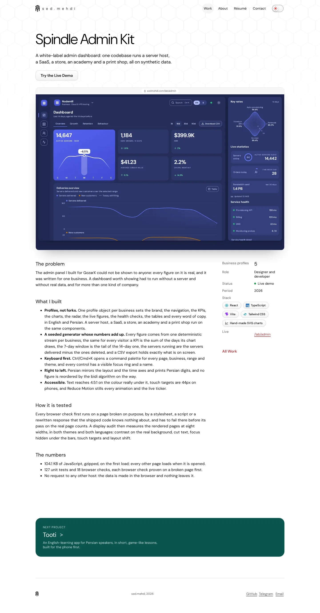 | 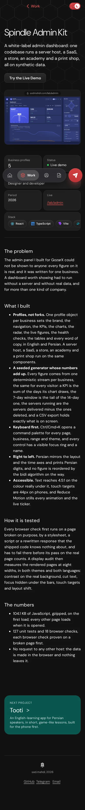 |

کیس‌استادی GozarX با خط پیوند به Spindle: [۱۴۴۰، روشن](screens-v2/gozarx-case-1440-light.webp).

### چهار کارت، بزرگ‌نمایی ۲×

| | دسکتاپ (stack، صفحهٔ Work) | موبایل (فهرست، صفحهٔ Work) |
|---|---|---|
| ۰۱ GozarX | 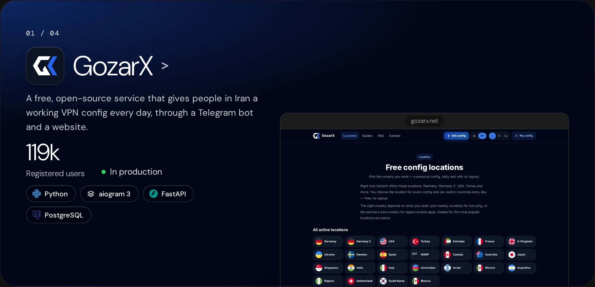 | 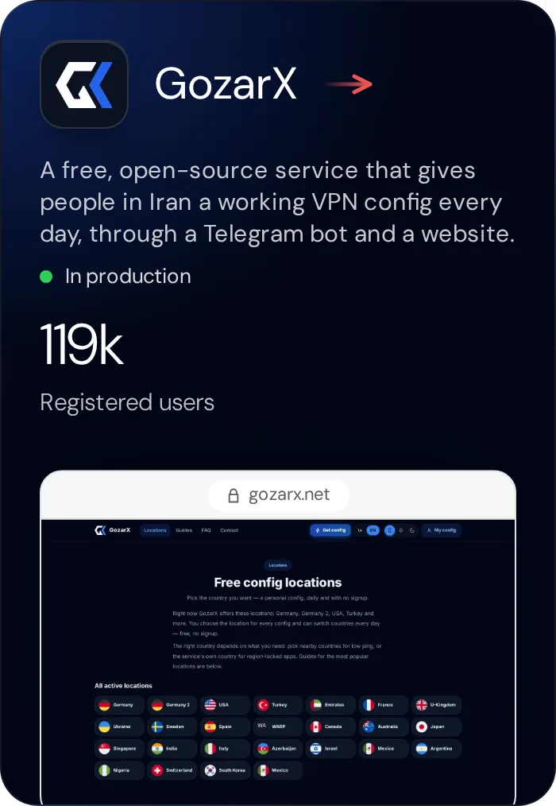 |
| ۰۲ Spindle |  | 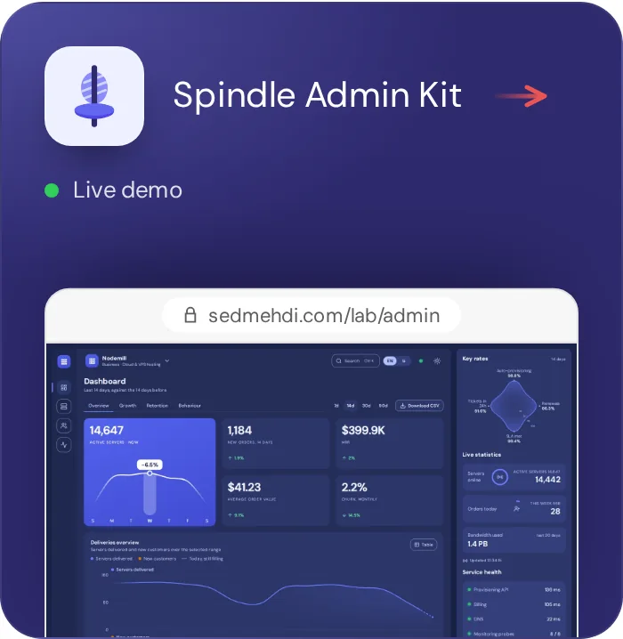 |
| ۰۳ Tooti | 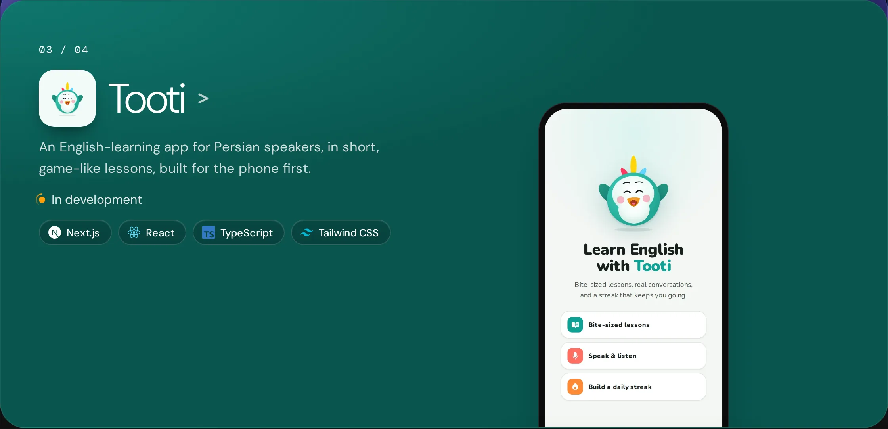 | 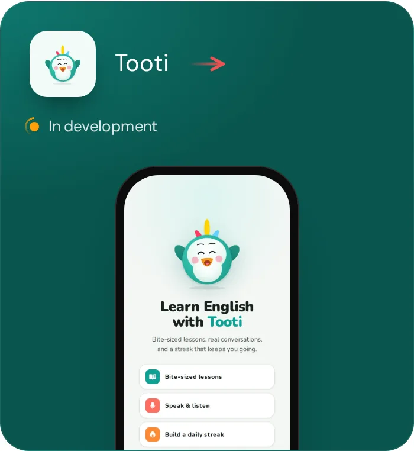 |
| ۰۴ Jozveyar | 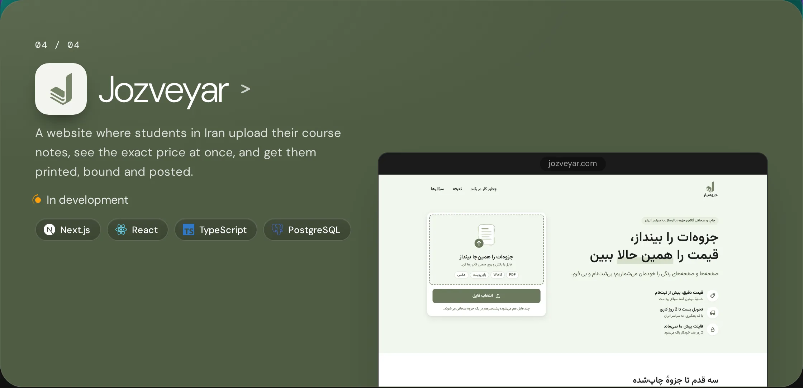 | 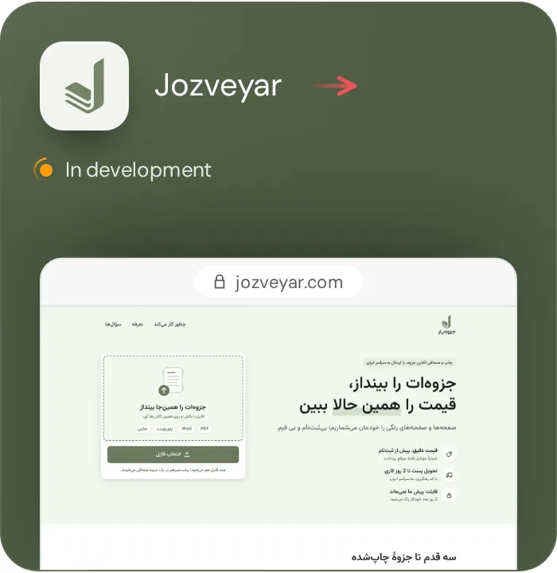 |

### Nodemill در دو تم و دو زبان

| | روشن | تیره |
|---|---|---|
| انگلیسی، ۱۴۴۰ | 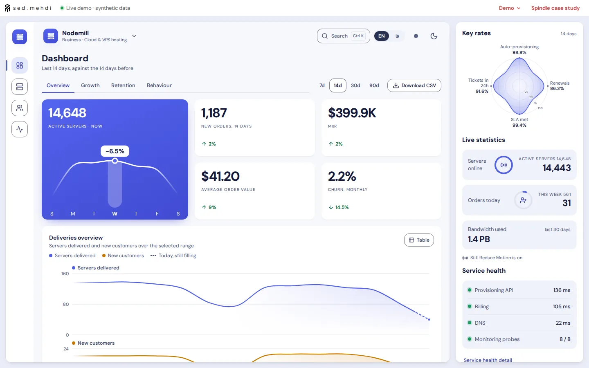 | 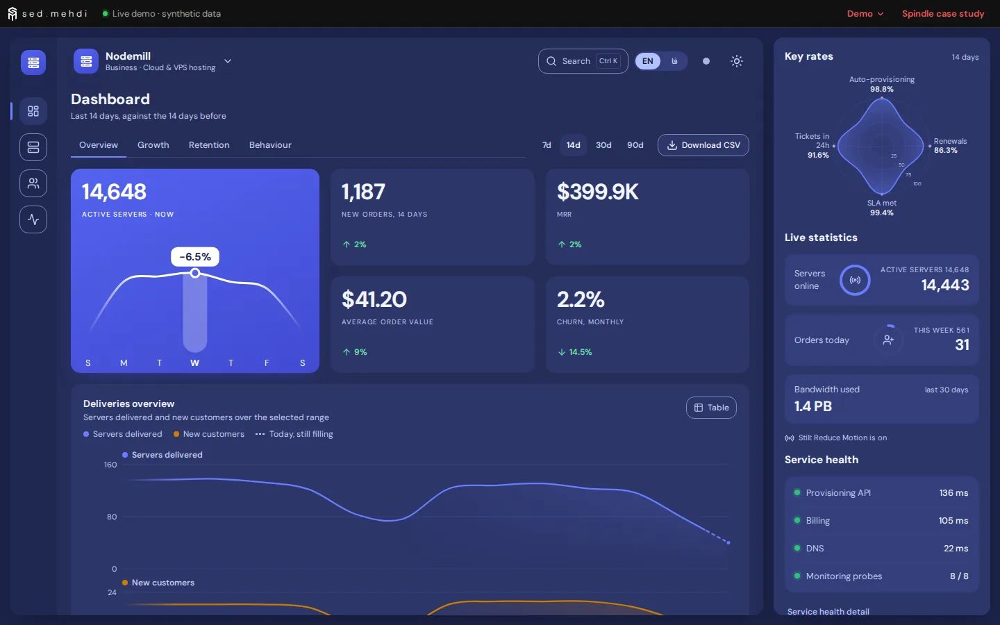 |
| فارسی، ۱۴۴۰ | 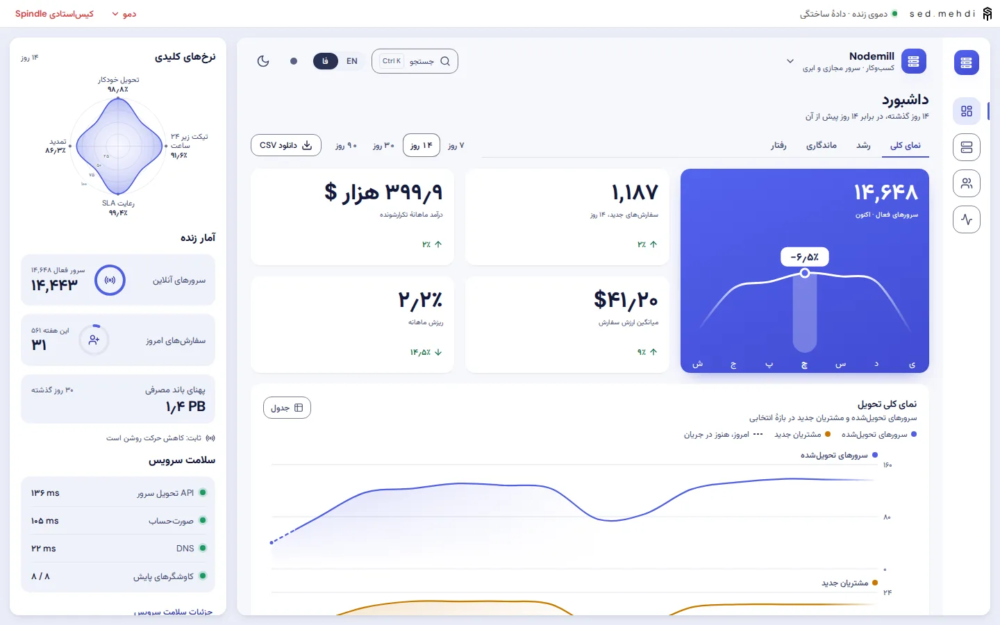 | 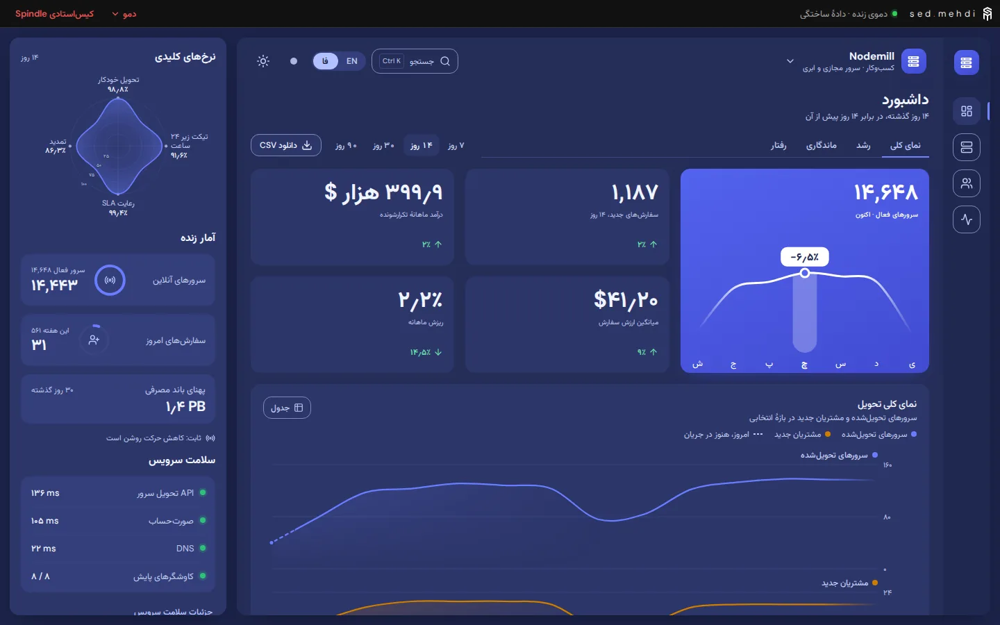 |
| انگلیسی، ۳۹۰ | 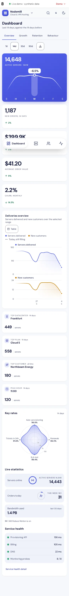 | 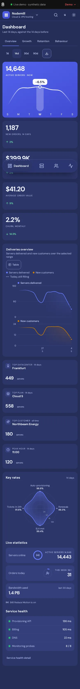 |
| فارسی، ۳۹۰ | 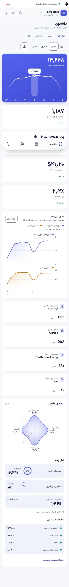 | 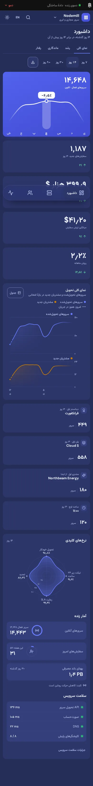 |

---

## ۹. یادداشت‌ها

### خطاهای خودم

شش اشتباه خودم پیدا شد. یکی را تست‌ها گرفتند، یکی را بازبینی تصویرها، و چهار تا را اجرای قبل/بعد:

1. **اصلاح اول B2 (B2′):** اسکرول را داخل خود رویداد focus صادر می‌کرد. Chromium در همان لحظه کارت سوم را خودش اسکرول کرده بود و اسکرول من آن را لغو کرد. `carousel_focus_check` در ۳۹۰، ۳۶۰ و ۳۲۰، با Reduce Motion و بدون آن، ۱۶ خطا داد. اصلاح دوم یک فریم صبر می‌کند و فقط کارتی را جابه‌جا می‌کند که هنوز کامل پیدا نیست.
2. **اصلاح B12 (B12′):** عنوان را متن معمولی کرد و عنوان‌های یک‌خطی از وسط کاشی لوگو بالا رفتند. این را در بازبینی تصویر B13 دیدم. اول تستی نوشتم (`title_logo_check`) که روی همان کامیت ۳۰ خطا داد، بعد اصلاحش کردم.
3. **نقطهٔ کور ممیزی:** هر متنی را که داخل یک ناحیهٔ اسکرول‌دار بود کنار می‌گذاشت. پس روی دسکتاپ تقریباً هیچ متنی از کنسول دمو را نمی‌سنجید و B5 را نمی‌دید. وقتی جدول قبل/بعد را پر می‌کردم پیدایش کردم. اصلاح شد (`fb35476`) و ممیزی نسخهٔ قبل با ابزار اصلاح‌شده دوباره اجرا شد. عددهای بخش ۳ از همین اجرای دوم است.
4. **بررسی `entry`:** نوار پایین موبایل را لینکِ روی کارت می‌شمرد (`fb2581b`).
5. **بررسی `words`:** نگاشت `vpn` را با backtick نمی‌شناخت (`ada7da9`).
6. **گام فوکوس ممیزی:** فوکوس را درست در لحظهٔ فشردن Tab می‌سنجید. carousel صفحهٔ Home، طبق اصلاح B2، کارت فوکوس‌شده را یک فریم بعد با اسکرول نرم به دید می‌آورد. پس ممیزی کارت‌های Spindle و Jozveyar را در ۳۹۰ و ۷۲۰ «پنهان» گزارش کرد. حالا بعد از هر Tab صبر می‌کند تا والدهای اسکرول‌دار عنصر و خود صفحه سه فریم ثابت بمانند (حداکثر یک ثانیه) (`522b686`). روی نسخهٔ قبل کارت Tooti اصلاً اسکرول نمی‌شود و همچنان گزارش می‌شود. ممیزی سایت در ۷۲۰، ۳۹۰ و ۳۲۰، که نوار ثابت دارند، با همین نسخه برای قبل و بعد دوباره اجرا شد. در عرض‌های بزرگ‌تر هیچ Tab-ی اسکرول نرم راه نمی‌اندازد، پس سنجیدن زودتر فقط می‌توانست خطای بیشتری نشان دهد؛ آنجا هم صفر بود. برای اطمینان، ممیزی سایت در ۱۴۴۰ با نسخهٔ جدید دوباره اجرا شد و همان نتیجه را داد.

موردهای ۴ تا ۶ روی صفحهٔ درست شکست می‌خوردند. با `--prove` دیده نمی‌شدند، چون آنجا هر بررسی فقط باید روی صفحهٔ خراب شکست بخورد. اجرای واقعی روی نسخهٔ نهایی نشانشان داد.

### مواردی که ممیزی گزارش می‌کند ولی باگ نیستند

- **نقطهٔ لوگوتایپ** (`.wm-dot` و `.demo-wm-dot`): کنتراستش ۳٫۴۶ تا ۳٫۵۴:۱ است. بخشی از لوگوست و WCAG 1.4.3 لوگو را استثنا می‌کند. ممیزی آن را کنار می‌گذارد.
- **خطای کنسول صفحهٔ ۴۰۴:** «Failed to load resource … 404» خطای خود درخواست صفحه است، نه خطای کد. ممیزی همین یک مورد را کنار می‌گذارد.
- **`http` و `js-error` روی `/projects/spindle/` در اجرای قبل:** این صفحه آن موقع وجود نداشت.

### تصمیم‌های طراحی این دور

- **گوشی افقی و پنجره‌های کوتاه (زیر 42.5em ارتفاع):** جلوهٔ stack کارت‌ها خاموش است. کارت‌ها ستونی عادی‌اند و هر کدام به اندازهٔ متنش. دیده‌شدن متن مقدم بر جلوه است؛ این حد با فونت بزرگ‌ترِ کاربر هم بالا می‌رود.
- **بین ۷۲۱ تا ۱۰۲۳:** نسبت ستون متن به تصویر ۱٫۲۵ به ۰٫۷۵ شد. تصویر کارت تزئینی است و از لبهٔ کارت بیرون می‌رود؛ متن کار اصلی کارت است.
- **خلاصهٔ Spindle:** «each from a single profile» از آن برداشته شد. همین ایده با عدد بزرگ «5 Business profiles» زیر خلاصه دیده می‌شود و در بدنهٔ کیس‌استادی هم آمده است.
- **فکت «Live» در کیس‌استادی:** پیوندش کمی پایین‌تر از برچسبش است، چون جعبهٔ پیوند ۴۴ پیکسل ارتفاع دارد (هدف لمسی). در GozarX هم همین است.
- **پیوندهای خروجی نسخهٔ تک‌فایلی:** پیوندهای بنر، منو و پالت در `preview/spindle-admin-demo.html` به سایت منتشرشده (`https://sedmehdi.com`) می‌روند، چون آفلاین سایتی کنار فایل نیست. فقط با کلیک کاربر باز می‌شوند و در بارگذاری هیچ درخواستی نمی‌سازند.

### حریم خصوصی

- **داده:** همه‌چیز ساختگی است. Nodemill، نام سرورها و مشتری‌ها از generator قطعی می‌آیند. نام دیتاسنترها شهرهای عمومی با کد فرودگاه است، مثل `fra` و `ams`.
- **GozarX:** ریپوی GozarX فقط خوانده شد و هیچ داده‌ای از آن وارد نشد.
- **میزبان دیگر:** صفر درخواست، هم در دمو (بررسی `hosts` و ممیزی) و هم در نسخهٔ تک‌فایلی.

### zip

`dist/` بعد از build نهایی zip شد و جدا پیوست می‌شود، بدون کامیت.
